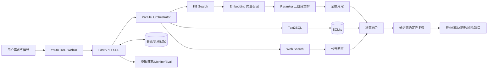

# SmartBuy Research Agent 开发指南

## 1. 文档信息

| 项目 | 内容 |
|---|---|
| 项目名称 | SmartBuy Research Agent（多源消费决策研究 Agent） |
| 文档用途 | 后续开发、测试、评测、提交和交付的主要执行依据 |
| 当前阶段 | 阶段 4：核心消费决策 Agent 工作流（已完成，等待用户验收） |
| 当前状态 | 有界 ReAct、KB/只读 SQL/Evidence/Web 降级工具、分层 Memory、Schema 报告、WebUI/SSE/Monitor 和 16 条 E2E 已实现；阶段 5 最终 Constraint Checker 尚未开始 |
| 最后更新时间 | 2026-08-27 |
| 运行基线 | Windows 11、Python 3.12、云端模型 API |

### 信息来源与优先级

本指南按以下优先级整理；发现冲突时保留高优先级要求，并在“风险与待决策事项”中记录，不静默改变项目方向：

1. 用户当前阶段指令。
2. [FINAL 开发交接文档](FINAL_多源消费决策研究Agent开发交接总文档.md)。
3. [阿里云百炼 API 调用说明](阿里云百炼API-Key调用与Youtu-RAG接入说明.md)。
4. 仓库当前代码和其他文档。

### 文档维护规则

- 本文件描述计划、阶段状态、验收口径和已确认决策；没有运行证据的能力一律标记为“计划”或“待验证”。
- 文件或目录变化时，在同一提交中同步 [PROJECT_STRUCTURE.md](PROJECT_STRUCTURE.md)。
- 能力、安装方法、配置项或测试结果变化时，在同一提交中同步 [README.md](README.md)。
- 每阶段完成后更新阶段状态、实际测试结果、Commit Hash、已知问题和回退结论。
- 目标值与实验结果严格分开；“建议目标”必须通过阶段 1～6 的基线测试校准。
- 不删除、移动、重命名或覆盖两份既有资料；需要修订时先取得用户同意。

## 2. 项目场景

### 真实日常场景

本项目服务于参数复杂、信息来源分散且存在时效差异的日常消费决策。MVP 聚焦“显示器选购”：用户给出预算、用途、桌面空间、接口、面板、刷新率等硬约束和软偏好，系统核验官方说明书、结构化参数和公开网页信息，筛选候选并形成可追溯的购买决策报告。

这不是“秋招辅助工具”。它是一个真实消费场景 Agent，只是其完整工程过程和评测结果可用于求职展示。

### 目标用户与具体问题

- 普通消费者：不愿手工阅读多份说明书和参数页，但需要可靠结论。
- 数码爱好者：需要比较多个型号、追踪事实来源并识别地区或版本差异。
- 重复使用者：希望系统记住预算风格、品牌排除项、尺寸限制等偏好。

用户通常面临以下问题：商品参数分散在 PDF、产品页、零售页和测评中；字段命名不统一；价格具有时间性；稳定规格与主观评价混杂；模型推荐容易忽略预算等硬约束；资料缺失时普通问答容易补全不存在的事实。

### 为什么现有方式不足

- 普通搜索返回链接列表，用户仍需自行核验、对齐型号和执行约束筛选。
- 普通聊天机器人缺少当前数据和来源边界，容易产生无依据规格或过期价格。
- 传统固定 RAG 主要执行单一向量检索，难以可靠完成数值筛选、SQL 计算、实时信息补充和工具降级。
- 本项目使用 Agentic RAG：根据任务选择知识库、Text2SQL、Web Search 和记忆，并把确定性规则用于最终硬约束复核。

### 代表性使用案例

用户提出：“预算 2500 元，主要编程、偶尔玩 FPS，桌面宽度有限，不考虑 OLED，希望有 27 英寸 4K、USB-C 供电和升降支架，请推荐两个型号。”

计划中的完整处理过程：

1. 提取预算、OLED 排除、尺寸和接口等硬约束，区分文本清晰度等软偏好。
2. 用 SQLite/Text2SQL 完成预算、尺寸、分辨率和接口的确定性候选筛选。
3. 用 KB Search 查官方说明书，核验 USB-C 视频输入、供电功率、支架和限制。
4. 仅在需要当前价格、库存或近期变化时调用 Web Search，并记录观察时间。
5. 用 Reranker 对召回证据二次排序；失败时保留向量召回结果并标记降级。
6. 汇总前再次以代码或 SQL 复核硬约束，移除违规候选。
7. 输出推荐、淘汰理由、证据、来源时间、冲突、未知项和下一步核验建议。

### 最终展示效果

最终 Demo 应让观察者在五分钟内确认：系统真实调用了不同工具；SQL 负责硬约束，知识库负责稳定事实，Web 负责时效信息；回答包含来源和不确定性；工具失败时仍能给出边界清晰的降级结果；Agentic RAG 的收益由同集评测而非单次演示证明。

## 3. 项目目的

### 用户价值

- 减少跨来源查找、对齐和核验的时间。
- 避免推荐违反预算、尺寸、接口等明确约束。
- 明确区分确定事实、主观证据、冲突信息和未知信息。
- 让推荐过程可解释、可追溯，而不是只给型号列表。

### 技术目标

- 基于 Youtu-RAG 构建多源 Agentic RAG 闭环。
- 验证 KB Search、Text2SQL、Web Search、Memory 和并行编排的真实调用能力。
- 接入阿里云百炼 `qwen-plus`、`text-embedding-v4`（1024 维）和 `qwen3-rerank`。
- 建立向量召回、二阶段重排、证据融合和确定性约束复核链路。
- 用 Direct LLM、Fixed RAG、Agentic RAG 和增强版本进行可复现实验。

### 工程目标

- 在 Windows 11 / Python 3.12 环境可复现运行。
- 建立清晰配置、错误处理、重试、缓存、监控、测试和版本记录。
- 对文档、SQLite、向量索引、价格快照和评测集进行版本治理。
- 保持密钥只存在于系统环境变量和进程内存中。

### 求职展示价值

展示端到端 Agent 应用工程能力：技术选型、上游二次开发、数据建模、工具编排、RAG、Text2SQL、前后端联调、可观测性、评测、安全边界和失败复盘。任何简历指标必须来自本项目真实结果。

### Non-goals

- 不做自动下单、支付、抢购、返利或电商账户操作。
- 不抓取登录后内容，不绕过验证码或网站访问限制。
- 不保证实时价格；价格必须携带来源、地区和 `observed_at`。
- 不将用户评论直接作为稳定规格事实。
- MVP 不训练或微调大模型，不以本地大模型推理为主要在线方案。
- MVP 不实现 GraphRAG、Neo4j 或完整知识图谱。
- 不对公网开放模型生成的 Python 执行器，不声称其为安全沙箱。
- 不声称支持多租户生产并发、生产级 SLA 或尚未实测的能力。

## 4. 功能范围

所有功能状态均以仓库中的运行证据为准。当前除文档体系外，以下均为“计划”。

### MVP 必须完成

| 功能 | 输入 | 处理过程 | 输出 | 失败降级 |
|---|---|---|---|---|
| Windows 基线服务 | 配置、文本型 PDF/Markdown | 启动 MinIO、Chroma、SQLite、FastAPI/WebUI | 可访问 UI、Monitor 和持久化存储 | 逐服务隔离排障；两天仍无法完成基础 KB 时评估 Kotaemon |
| 产品资料管理 | 公开官方文档和来源清单 | 校验来源、元数据、文件哈希、解析和切分 | “显示器官方资料库” | 扫描 PDF 暂不 OCR，改用文本版或自制摘要 |
| 文档事实核验 | 型号与规格问题 | Embedding 召回、Reranker、证据提取 | 带文件名/URL 的事实回答 | Reranker 失败退化为向量排序；无证据则拒答 |
| 结构化筛选 | 预算、尺寸、分辨率、接口等约束 | Text2SQL 查询 SQLite，并与人工 SQL 对照 | 候选和未满足条件 | Text2SQL 失败时执行受控模板 SQL，并标记降级 |
| 多源决策 | 完整消费需求 | Parallel Orchestrator 调用 KB + SQL；Web 用于时效补充 | 推荐、淘汰、证据、风险、数据缺口 | Web 失败仍用 KB + SQL；并行失败则串行调用并保留轨迹 |
| 硬约束复核 | 最终候选与硬约束 | 确定性代码或 SQL 二次验证 | 合规候选及违规字段 | 复核器异常时不得宣称候选通过，返回待核验状态 |
| 统一决策报告 | 工具结果和偏好 | 结构化融合与引用绑定 | 稳定 Markdown，增强版为受校验 JSON | 校验失败返回 Markdown 和验证错误，不丢失原始证据 |
| 基础可观测与评测 | 固定问题集 | 记录工具、耗时、失败、Token/成本（若可得） | 可复核结果文件和 Monitor 轨迹 | 追踪系统不可用时写本地脱敏结构化日志 |

MVP 数据门槛为 10～15 个显示器、10～20 份官方资料、至少 30 条评测任务。Parallel Orchestrator 至少跑通 KB + SQL；正式演示目标再加入一条 Web 补充任务。Web 凭据不可用不得阻塞 KB + SQL 主闭环。

### 增强功能

| 功能 | 输入与处理 | 输出 | 降级方式 |
|---|---|---|---|
| 短期/长期 Memory | 保存用户偏好和已验证处理经验，不保存产品事实真相 | 同会话或跨会话偏好复用 | 关闭 Memory，要求用户显式重述偏好 |
| Excel Agent | 可信规范表格，经受限工作目录中的 Python/IPython 分析 | 代码、统计结果和反思轨迹 | 回退 SQLite/CSV 脚本；不阻塞主链路 |
| 逐句引用与冲突提示 | 把原子事实绑定到证据片段和来源版本 | 更细粒度的报告 | 回退到段落级来源并标明引用粒度 |
| 缓存与成本面板 | 缓存稳定检索结果，统计模型与工具成本 | 延迟、命中率、费用视图 | 缓存故障时绕过缓存，不影响正确性 |
| 消费决策卡片 | 结构化候选和证据 | 前端对比卡片 | 回退到现有 WebUI Markdown 展示 |

### 可选实验功能

- Excel worker 并行编排：只有独立 Excel Agent、文件路径和会话隔离验证后才能启用。
- 第二商品类别（如路由器）：用于验证数据 Schema 和 Agent 迁移性。
- GraphRAG：仅在 MVP、评测和硬约束复核完成后，经单独 ADR 与用户确认再做对照实验；当前不属于项目主线，也不得写入已实现能力。
- 本地小模型或本地 Embedding：仅做成本/降级实验，不作为在线主方案。

### 明确不做

除 Non-goals 外，不优先重写整个上游前端、不并行引入 GraphRAG/新前端/本地模型/Excel 编排，也不为了功能数量复制能力相同的 Agent。

## 5. 数据方案

### 数据来源与使用边界

| 来源 | 用途 | 公开性与许可处理 | 可信级别 |
|---|---|---|---|
| 官方说明书、支持文档 | 稳定规格、功能限制、保修 | 公开可访问；逐项记录 URL、版本和许可，未获再分发许可的原 PDF 不提交 | 最高 |
| 官方产品页 | 规格和地区版本补充 | 公开页面；保存 URL、抓取时间和必要摘要 | 高 |
| 可信零售商页面 | 价格、库存、销售版本 | 仅使用公开页面；不登录、不绕过限制；价格记录时间 | 中高 |
| 专业测评媒体 | 使用体验、测量证据 | 记录作者、日期、URL；只保存合规摘要，不大段复制 | 中 |
| 公开用户评价 | 主观问题线索和风险聚类 | 不作为稳定事实；聚合、去标识化并遵守平台条款 | 低 |
| 用户偏好 | 预算、硬约束和软偏好 | 只保存 Demo 所需最少字段；不保存敏感身份信息 | 非产品事实源 |

禁止依赖无法稳定获得权限的私有接口。动态网页只用于补充，主 Demo 在无 Web 时仍须由 KB + SQL 成立。

### 采集与导入方式（计划）

1. 人工建立来源清单，优先官方文档和公开产品页。
2. 合规下载文本型 PDF/Markdown，计算 SHA-256；不能再分发的文件只保留下载清单和校验值。
3. 用 CSV/JSON 维护产品目录和来源记录，由可重复脚本生成 SQLite 与 Demo Excel。
4. 价格按观察记录追加，禁止覆盖历史价格。
5. 文档解析、清洗、切分和向量化均记录代码版本、配置版本和索引版本。

### 计划数据格式和核心字段

当前尚未创建数据文件、数据库或 Schema；以下均为“计划”。

- `products`：`model_id`、品牌、型号、类别、尺寸、分辨率、刷新率、面板、OLED、USB-C、供电功率、接口版本、支架、宽度、重量、保修、发布日期、官方来源和来源更新时间。
- `price_observations`：`observation_id`、`model_id`、价格、商家、地区、库存、URL、`observed_at`、价格类型。
- `source_records`：`source_id`、`model_id`、来源类型、标题、URL、是否官方、发布日期、获取时间、校验值和备注。
- `evidence_records`（计划扩展）：`evidence_id`、`source_id`、`model_id`、原子事实字段、规范值、证据片段位置、可信级别、有效时间和冲突组。
- `review_signals`（计划扩展）：`model_id`、主题、情感/频次、样本量、来源范围和时间窗口；不得提升为确定规格。
- 用户偏好：预算、用途、硬约束、软偏好、排除品牌和更新时间；硬约束与软偏好分开。
- 评测 JSONL：`case_id`、问题、类别、`required_tools`、硬约束、金标事实、金标来源、期望行为和 `should_abstain`。

### 清洗、去重、切分和版本管理（计划）

- 型号统一大小写、空格、地区和后缀；不同地区版本不强行合并。
- 布尔值统一为 `true/false` 或 `0/1`；未知值为空，不能用 `0` 表示未知。
- 单位规范为 CNY、mm、inch、Hz、W、kg，并保留原始值用于审计。
- URL 规范化后结合内容 SHA-256 去重；同源新版本保留版本链而非覆盖。
- PDF 先按标题/段落切分，再用固定 token 窗口和重叠；表格、接口限制和脚注尽量保持同块。
- 每个 chunk 保存 `doc_id`、页码/章节、来源 URL、版本、模型 ID、维度和切分配置版本。
- 数据、Schema、提示词、索引和评测集分别版本化；Embedding 模型或维度变化必须新建索引并全量重建。

### 多源统一规则

所有事实以 `model_id + normalized_field + region/version + effective_time` 对齐，通过 `source_id/evidence_id` 追踪。稳定规格默认优先级为官方说明书、官方支持文档、官方产品页、可信零售商、测评媒体、论坛/用户评论；价格和库存还必须比较 `observed_at`。评论只能形成“用户反馈信号”，不得覆盖官方规格。

### 数据规模

- MVP：10～15 个显示器、10～20 份官方文档、1 个 SQLite、1 份对应 Excel/CSV、30～50 条评测任务，其中 5～10 条为证据不足、冲突或工具失败题。
- 正式演示建议目标：20～30 个显示器、20～40 份治理后的资料、60～100 条评测任务；需根据人工核验成本校准，不以数量牺牲质量。

### 评测集设计

- 正例：证据明确的单文档事实、多文档比较、SQL 组合筛选和完整多源任务。
- 困难负例：名称相近型号、地区版差异、旧价格与新价格、USB-C 有接口但无视频/供电、字段缺失、来源冲突。
- 无关样本：与显示器无关的文档、只含营销措辞的网页、不能支持目标事实的段落，用于检验召回和拒答。
- 故障样本：Web 关闭、Reranker 超时、Embedding 429、数据库缺字段、Memory 关闭。
- 同一数据版本上对比 Direct LLM、Fixed RAG、Agentic RAG 和 Agentic RAG + Constraint Check；动态 Web 保存时间或快照。

### 缺失、冲突与过期信息

- 未找到证据时返回“无法确认”，不以常识补齐。
- 同一稳定规格冲突时列出双方来源、版本和地区，按来源优先级提出建议但保留冲突。
- 价格必须带观察时间；过期阈值需在数据阶段按来源类型配置，过期数据只能作为历史参考。
- 关键硬约束字段未知时，候选不得标记为“已满足”，只能淘汰或列为待确认。

### 版权、隐私和合规

- 公开仓库仅提交许可允许的数据、自制结构化数据、来源清单、校验值和必要短摘要。
- 不提交受限 PDF 全文、登录后内容、个人隐私、Cookie、Token 或完整用户评论语料。
- 引用保留出处，不进行大段复制；数据卡记录来源、用途、时间、许可和删除方式。

## 6. 技术架构

### 计划主流程



### 模型职责边界

- LLM `qwen-plus`：理解任务、拆分子任务、选择工具和生成报告；不负责可靠数值筛选，不可替代事实来源。
- Embedding `text-embedding-v4`（固定 1024 维）：把文档块和查询映射到同一向量空间，负责高召回候选生成；不直接证明事实正确。
- Reranker `qwen3-rerank`：结合查询对召回候选二次排序，减少无关上下文；其分数只在同次请求内比较，不等于正确概率。
- SQLite/Text2SQL：执行硬条件筛选、排序和计算；生成 SQL 必须可审计并与人工 SQL 对照。
- 硬约束复核器：在最终输出前做确定性验证，是首选项目核心增强点。

### Agentic RAG 与 GraphRAG

Agentic RAG 是当前主线：Agent 自主选择或编排 KB、SQL、Web 和 Memory，并根据工具反馈继续处理。GraphRAG 当前不实现、不宣称；只有在 MVP 和基线评测稳定后，才可能作为单独实验评估，且不能替代当前结构化 SQL 主链路。

### 工具、状态、记忆、存储和展示

- 工具：阶段 4 已实现 KB Search、只读 Text2SQL、Evidence Check 和 Web Search `unavailable` 接口；Meta Retrieval、Excel Agent 和真实 Web Search 仍是增强能力。
- 状态：当前沿用单用户、单进程边界，服务只绑定 `127.0.0.1`；结构化 Agent 状态保存需求、候选、工具观察和公开轨迹，进程级状态/环境变量不适合多租户。
- 记忆：短期会话已支持约束和候选继承/覆盖；长期仅在用户明确确认后保存白名单内的稳定偏好，支持查看、覆盖、删除和关闭，不保存商品事实、价格、库存或模型推测。
- 存储：MinIO 保存上传文档，Chroma 保存向量，SQLite 保存产品/价格/来源，长期偏好和临时执行文件位于仓库外专用目录。
- 展示：已复用 Youtu-RAG WebUI、SSE 和 `/monitor` 展示 SmartBuy 模式、工具状态、来源摘要和最终 Markdown 报告；完整 Prompt、隐藏思维链和敏感错误不进入前端。

### 正常链路与降级链路

| 故障 | 正常链路 | 降级处理 |
|---|---|---|
| Reranker 失败 | 向量召回 → 重排 | 使用向量排序，记录 `reranker_degraded=true` |
| Web 失败 | KB + SQL + Web | 继续 KB + SQL，明确缺少当前价格/库存 |
| Text2SQL 失败 | 模型生成并执行 SQL | 使用受控查询模板或人工验证 SQL，不让 LLM 心算 |
| Memory 失败 | 自动复用偏好 | 要求当前请求显式提供偏好 |
| Excel 失败 | Python 分析 | 使用 SQLite/CSV 脚本；不阻塞主流程 |
| 并行编排失败 | 多 worker 并行 | 串行调用已验证工具并保存轨迹；未修复前不宣称自动编排 |
| 证据不足 | 检索并生成 | 拒绝强结论，输出缺失字段和下一步核验建议 |

### 可观测性和评测链路

每个复杂任务至少记录脱敏的 case/request ID、选择的 Agent/worker、工具和参数摘要、重试、各阶段耗时、最终来源、Token 与成本（API 提供时）、降级标志和配置版本。固定评测集由统一 Runner 驱动四组 Baseline，原始结果按 commit、模型、数据版本和运行时间保存，并保留失败样本。

## 7. 模型和 API 方案

### 固定优先方案

| 能力 | 模型 | 接口形态 | 状态 |
|---|---|---|---|
| LLM | `qwen-plus` | Workspace 专属 OpenAI-compatible `chat/completions` | 普通、SSE 流式、Tool Calling 均已验证 |
| Embedding | `text-embedding-v4`，固定 1024 维 | Workspace 专属 `/compatible-mode/v1/embeddings` | 批量数量/顺序/维度、语义冒烟、Youtu 建库与 KB Search 已验证 |
| Reranker | `qwen3-rerank` | Workspace 专属 `/compatible-api/v1/reranks` | 独立排序、Youtu 二阶段排序、有限重试和向量降级已验证 |

### 环境变量与当前可用性

- `Qianwen_api_key`：必需、敏感；2026-08-26 当前继承进程检查为 `configured`。阶段 1 配置响应和阶段 2 Toolkit 日志分别暴露过当时的 Key；两次均已停止服务、清理本地输出并由用户禁用/轮换，当前值禁止输出或持久化。
- `Qianwen_workspace_id`：必需、配置项；2026-08-26 当前继承进程检查为 `configured`，并已由用户确认有效。
- Key、Workspace 和地域必须匹配；当前说明文档约定中国大陆华北 2（北京）。

业务代码只能通过统一配置对象和 `os.getenv` 读取当前进程继承的变量。允许在启动子进程内把 `Qianwen_api_key` 映射到 `UTU_LLM_API_KEY`、`UTU_EMBEDDING_API_KEY` 和 `UTU_RERANKER_API_KEY`，禁止从 Windows 注册表读取，禁止打印或持久化这些值。真实密钥不得写入 `.env`；非敏感模型名和 URL 可由配置文件管理。

### Youtu-RAG 适配检查

- LLM：验证普通对话、SSE 流式、Function/Tool Calling、Token 统计、超时与 429 重试。
- Embedding：检查上游是否先访问 `/model_id`；若存在，优先新增直接调用 `/embeddings` 的 Provider，而不是盲目重试不存在的健康端点。
- Reranker：完整 `/reranks` 地址应原样使用，支持顶层 `query/documents/top_n/instruct`，从顶层 `results` 解析。
- HTTP 400/401/403/404 不盲目重试；429、5xx 和网络超时最多有限重试 2～3 次并加入抖动。
- 日志仅允许模型名、端点域名、状态码、请求 ID、耗时、候选数和 Token；禁止 Authorization 头、Key 和未经脱敏的完整请求体。

## 8. 开发环境与约束

| 项目 | 基线/约束 |
|---|---|
| 操作系统 | Windows 11 原生，不先引入 WSL/Docker |
| Python | 3.12；当前检测为 3.12.3 |
| uv | 当前检测为 0.12.3 |
| CPU | Intel i5-10400F |
| 内存 | 32 GB |
| GPU | GTX 960，2 GB |
| 在线模型 | 云端百炼 API 为主要方案 |
| 本地模型 | 仅可选实验或降级；不下载/运行 2B Embedding 作为主方案 |
| 路径 | 仓库为 `E:/Agent_project/proofpick_agent`；上游固定在 `vendor/youtu-rag/`，运行数据放在短 ASCII 仓库外路径 `C:/ai/` |

强制约束：

- 不读取、回显或打印 `Qianwen_api_key` 的值。
- 不把真实密钥写入 `.env`、源码、Markdown、日志、测试快照或 Git。
- Embedding 模型、维度或预处理变化后必须建立新索引并全量重建，不能复用旧向量目录。
- 保留用户已有文件、未跟踪文件和 Git 历史；不 force push、不重写历史、不使用 `git reset --hard`。
- Python Executor 只能处理可信文件，使用普通权限和专用工作目录，不绑定公网。

## 9. 验收指标

以下数值是全项目**建议目标**；已取得的阶段 3 检索基线在表后和[阶段 3 报告](smartbuy/docs/stage3_data_and_retrieval_report.md)中单独记录，不能外推为完整 Agent 指标。

| 指标 | 定义、测试数据与计算 | 建议目标 | 验收命令或操作 | 未达标处理 |
|---|---|---|---|---|
| 核心功能成功率 | 冒烟矩阵中成功功能数 / 应测功能数；覆盖上传、建库、KB、SQL、编排、Monitor | MVP 必选项 100%，非阻断增强项单列 | 计划 `uv run pytest tests/smoke -q` + 人工 UI 检查 | 阻断项不完成阶段；增强项降级并记录 |
| 端到端任务完成率 | 满足预先定义行为的任务数 / 全部 E2E 任务 | ≥85% | 计划 `uv run python smartbuy/eval/run_eval.py --suite e2e` | 分类别定位数据、路由、生成失败，修复后重跑 |
| Recall@K | Top-K 型号集合覆盖金标型号的比例，按可评估问题取平均 | Recall@5 ≥90% | `python -m smartbuy.eval.run_retrieval_eval`（真实调用、有费用） | 调整切分、元数据、查询和 K，禁止只挑成功样本 |
| nDCG@K / MRR | 按二元型号相关度计算 nDCG@5；只有单一金标时可补充 MRR | nDCG@5 ≥0.85 或 MRR ≥0.80 | 同一 Runner 比较 Vector-only 与 Reranker | 校准候选数和重排适配；保留向量基线 |
| 硬约束满足率 | 推荐候选满足的硬约束数 / 应满足总数；任务级任一违规即失败 | 字段级与任务级均 100% | 计划 constraint scorer + 人工 SQL 抽查 | 阶段 4/5 不完成；违规候选确定性移除 |
| 证据引用正确率 | 引用内容直接支持对应原子事实数 / 全部引用事实数 | ≥95% | 计划 evidence scorer，人工复核至少 20% | 降低声明粒度、修复来源绑定或拒答 |
| 无依据结论比例 | 无可访问证据支持的外部事实数 / 全部外部事实数 | ≤5%，关键硬约束为 0 | 计划 unsupported-claim scorer + 人工抽查 | 增加引用校验，无法支持的结论删除或标未知 |
| API 调用成功率 | 排除主动故障注入后成功请求 / 全部有效请求，按模型分开 | 每类 ≥98%（建议） | 最少每类 30 次可控测试并统计状态码 | 检查权限、端点、限流和退避；外部故障单列 |
| 平均延迟 | 端到端 wall time 均值；简单 KB 与复杂任务分组 | 简单 KB ≤15 秒；复杂任务 ≤60 秒（建议） | Eval Runner 记录阶段耗时 | 优化并行、缓存和 top-k；不牺牲正确性 |
| P95 延迟 | 同分组任务的第 95 百分位 | 简单 KB ≤30 秒；复杂任务 ≤120 秒（建议） | 至少 30 次样本后计算 | 分析慢工具、超时和重试；必要时降级 Web |
| 单次任务成本 | LLM、Embedding、Reranker 调用费用之和 / 完成任务数 | 复杂任务平均 ≤0.50 元（暂定，需价格与基线校准） | Token/调用量 × 当期官方单价 | 降低无效调用、缓存稳定结果；超预算前停止批测 |
| 降级链路可用性 | 故障注入时仍输出边界清晰结果的任务数 / 降级用例数 | ≥90%，且不得静默伪装正常 | 关闭 Web/Reranker/Memory、模拟 429/超时 | 修复错误传播；无法降级的能力标为阻断或移出 Demo |
| Windows 可复现性 | 按 README 在干净 Windows 用户环境完成核心 Demo 的步骤通过率 | 核心步骤 100%，无未记录手工修补 | 阶段 7 在干净目录复跑 README | 补依赖锁、路径说明和脚本，失败则不发布 |
| 敏感信息扫描 | Git 历史与待提交内容中的真实 Key、私钥、`.env`、Authorization 头 | 0 个高可信发现 | `git diff --cached`、`git ls-files`、规则扫描；可引入 gitleaks | 立即取消提交并清理；若泄露则轮换 Key |
| 自动化测试 | 单元/集成/E2E 测试通过率与关键自研模块覆盖率 | 测试 100% 通过；关键模块覆盖率 ≥80%（建议） | 计划 `uv run pytest -q --cov` | 修复失败；无法自动化项记录人工证据，不虚报覆盖率 |
| 最终演示案例数 | 可重复运行且保存证据的案例 | ≥4：单文档、SQL、多源、边界/降级各至少 1；建议备用录屏 | 五分钟演示脚本逐项执行 | 不稳定能力移出演示，保留真实边界说明 |

阶段 3 固定 40 条检索任务的真实结果：36 条有金标任务上，Vector-only / Vector + Reranker 的 Recall@5 分别为 0.8912 / 0.9838，nDCG@5 分别为 0.8170 / 0.9541；4 条无依据或无关问题的固定阈值拒答为 0/4。

阶段 4 固定 16 条 Agent E2E 的真实结果：工具选择 16/16，7 条正例任务型号召回 7/7，9 条应拒答任务 9/9，8 条依赖式多跳 8/8，Schema 16/16，端到端 15/16；平均/P95 为 25.900/40.195 秒。唯一失败由模型臆加用户未提出的显示尺寸约束造成；改为仅接受用户显式给值的资格字段后，该样本独立回归 1/1。该结果证明阶段 4 字段拒答有效，但不等同于阶段 5 最终硬约束满足率已验收。

## 10. 分阶段开发计划

阶段编号以本指南为准；它将原交接文档的运行阶段重新映射到当前“先文档、再基线、再百炼适配”的执行顺序，不改变产品方向。

### 阶段 0：文档、仓库和开发规范初始化

- 阶段目标：建立唯一入口 README、主要执行指南和真实结构地图。
- 前置依赖：两份既有资料可读；Git 远端已关联。
- 开发任务：核对 Git；完整阅读资料；创建三份根文档；检查链接、敏感信息和暂存范围；独立提交并推送。
- 预计模块：`DEVELOPMENT_GUIDE.md`、`PROJECT_STRUCTURE.md`、`README.md`。
- 交付物：三文档体系、冲突和待确认项记录。
- 测试方法：相对链接存在性、Markdown 基础检查、敏感模式扫描、`git diff --cached --check`。
- 退出条件：三文档存在且互链；仅三文档进入提交；推送成功；向用户报告 Hash。
- 风险与回退：既有未跟踪文件误提交；通过显式路径暂存规避。推送失败则保留本地提交并如实报告。
- 文档更新：三份文档同步当前阶段和真实结构。
- 建议 Commit Message：`docs: initialize development guide and project map`。

### 阶段 1：上游项目基线运行与 Windows 环境验证

- 阶段状态：**已完成（2026-08-26）**。
- 阶段目标：固定 Youtu-RAG commit，在 Windows 跑通未改 SmartBuy 业务逻辑的依赖、服务、基础 Chat、文件和知识库配置链路。
- 前置依赖：阶段 0 已完成；Windows 持久化环境变量已配置；短 ASCII 运行路径、网络和 MinIO 可用。
- 开发任务：以 subtree 固定上游；记录 commit/license/差异；`uv sync --frozen`；启动 MinIO、FastAPI/WebUI；关闭 OCR/HiChunk、本地模型和阶段 1 Reranker；验证文件、KB 配置和基础 Chat；修复配置接口凭据回显。
- 实际模块：`vendor/youtu-rag/`、`smartbuy/scripts/start_youtu_rag.ps1`、`smartbuy/docs/`、脱敏安全测试、根目录许可证与第三方声明。
- 交付物：[Runtime Manifest](smartbuy/docs/runtime_manifest.md)、[ADR-0001](smartbuy/docs/adr/0001-vendor-youtu-rag.md)、[冒烟记录](smartbuy/docs/stage1_smoke_test.md)、许可证与差异记录。
- 测试方法：关键导入、MinIO health、UI/Monitor、Markdown 上传、知识库创建与文件关联、基础非流式 Chat、配置响应脱敏单测和接口回归。
- 量化退出条件：`uv sync --frozen` 成功且锁文件不变；三个 HTTP 入口均为 200；上传、KB 关联、基础 Chat 均成功；配置 Key 字段 100% 脱敏；敏感扫描为零；上游 commit 可追溯。KB Build/KB Search 改为阶段 2 完成 Embedding Provider 与 1024 维验证后的退出项，避免跨阶段误调用。
- 实际结果：上述阶段 1 条件全部满足；KB 文件当前为 `pending`、0 chunks，未宣称已完成向量检索。
- 风险与回退：发现上游配置响应会返回解析后的凭据；已轮换旧 Key、增加递归脱敏与测试，并让启动脚本排除陈旧 Process 环境。Embedding 失败时不建库、不复用索引，转阶段 2 明确处理。
- 文档更新：已记录真实目录、命令、版本、上游差异、未验证能力和安全处置。
- 建议 Commit Message：`chore(stage1): establish youtu-rag windows baseline`。

### 阶段 2：阿里云百炼 LLM、Embedding、Reranker 适配

- 阶段状态：**已完成并通过用户验收（2026-08-26）**。
- 阶段目标：安全复用系统 Key，分别跑通三类模型并接入 Youtu-RAG。
- 前置依赖：阶段 1 基线；`Qianwen_workspace_id` 已配置且用户确认有效；百炼权限与北京地域匹配。
- 开发任务：统一配置加载；普通/流式/Tool Calling；Embedding 1024 维和 `/model_id` 兼容处理；Reranker `/reranks`、顶层 `results`、用量统计；建库、KB Search、二阶段排序；超时/重试/降级/脱敏日志。
- 实际模块：`smartbuy/config/`、`smartbuy/providers/`、`smartbuy/observability/`、验证脚本、单元/集成测试，以及最小供应商兼容补丁。
- 交付物：[ADR-0002](smartbuy/docs/adr/0002-bailian-provider-and-index-contract.md)、[阶段 2 验证记录](smartbuy/docs/stage2_bailian_verification.md)、三模型 Provider、错误矩阵和成本起始基线。
- 测试方法：5 次有界真实模型调用；阶段 1 夹具强制重建；实际 Chroma count；Youtu KB Search + Rerank；401/429/超时/错误维度/503 模拟；日志与工作区敏感扫描。
- 退出条件：三类 API 正常；测试知识库 `completed` 且 API/Chroma 均为 2 chunks；KB Search 与二阶段排序成功；17 tests passed；核心静态检查通过；Key 匹配为零；失败状态有正确重试或拒绝/降级策略。
- 实际结果：退出条件全部满足。最终独立验证 398 input + 31 output tokens，估算 0.0003243 元；正式质量指标仍需阶段 3～6 评测集，不能由单样本推断。
- 风险与回退：已修复向量路径分裂、`force_rebuild` 二次跳过和 Toolkit 配置日志泄露；Reranker 失败回退向量排序，Embedding 失败/维度错误阻断建库，无 Web 凭据时使用基础 Chat + KB。
- 文档更新：Runtime Manifest、项目结构、README、供应商差异、ADR 和验证记录已同步；只记录变量名、模型与脱敏统计。
- 建议 Commit Message：`feat(stage2): integrate bailian model providers`。

### 阶段 3：数据采集、统一结构、清洗和知识库构建

- 阶段状态：**已完成并验收（Commit `068224003fd99e41c3020423cdca7faa6a16af1d`）**。
- 阶段目标：建立可追踪、可重建的显示器数据、SQLite、知识库和检索基线。
- 前置依赖：阶段 2 Embedding 稳定；来源许可和首批型号确定。
- 实际开发：统一四实体 Schema；来源/许可/冲突治理；事实卡与 processed JSONL 生成；SQLite 原子重建与 CSV 可选导出；H2 切分、1024 维索引；40 条 Vector/Reranker 评测。
- 实际模块：`smartbuy/data/`、`smartbuy/db/`、`smartbuy/retrieval/`、`smartbuy/eval/`、阶段 3 脚本、单元测试、数据卡、ADR-0003 和阶段报告。
- 交付物：12 个型号、4 个品牌、16 份治理资料、4 条价格观察、180 条证据、12 张事实卡、工作区外 SQLite/Chroma、40 条评测任务和离线结果。
- 测试方法：唯一性/URL/单位/三态/缺失/重复/地区/外键/哈希检查；SQLite 连续重建；人工抽查 3/12 型号；索引全量元数据检查；Vector/Reranker 真实评测和强制降级。
- 量化退出条件：自动质量错误 0；SQLite `integrity=ok`、外键违规 0 且连续逻辑哈希一致；构建状态 `completed`，60 文档/60 chunks；Reranker Recall@5 0.9838、nDCG@5 0.9541；成本小于 10 元。
- 实际结果：退出条件满足。固定阈值拒答 0/4 是非阻断但高优先级边界；本阶段未实现自然语言回答、Text2SQL、ReAct、Memory 或确定性硬约束。
- 风险与回退：不提交第三方全文；动态价格追加且带时间；冲突并列保存；Reranker 失败保留向量顺序；组合约束和拒答转由阶段 4 的 SQLite/证据复核承担。
- 文档更新：[数据卡](smartbuy/docs/data_card.md)、[ADR-0003](smartbuy/docs/adr/0003-governed-monitor-data-and-index.md)、[阶段 3 报告](smartbuy/docs/stage3_data_and_retrieval_report.md)、Runtime Manifest、项目结构和 README 已同步。
- 建议 Commit Message：`feat(stage3): build governed monitor dataset and knowledge base`。

### 阶段 4：核心消费决策 Agent 工作流

- 阶段状态：**已完成（2026-08-27，等待用户验收）**。
- 阶段目标：形成 KB + Text2SQL + Evidence Check + 可选 Web 的真实多源决策闭环。
- 前置依赖：阶段 3 数据、工作区外 SQLite/Chroma 和阶段 2 百炼 Provider；均满足。
- 实际开发：任务类型/显式约束解析；最多 8 步的 qwen-plus Tool Calling；工具白名单、超时、预算和停止门；只读 Text2SQL；KB 二阶段检索；字段四态 Evidence；Web unavailable 降级；会话/长期偏好 Memory；Pydantic/Markdown 报告；SSE 与 Monitor 展示。
- 实际模块：`smartbuy/agent/`、`api/`、`domain/`、`memory/`、`tools/`、Agent monitor、阶段 4 Eval/测试、ADR-0004 与技术报告；供应商 WebUI/API 只做接线路由和展示补丁。
- 交付物：16 条 E2E 与脱敏结果、3 个可重复多跳案例、7 组 SQL 金标、安全攻击用例、5 类 Memory 生命周期测试、结构化报告和真实服务冒烟。
- 测试方法：提交前完整项目回归 56 passed；4 条 dry run 后 16 条真实 E2E；失败用例独立复现/修复；回环地址 WebUI/SSE/Monitor 人工冒烟；Ruff/编译/JS 语法与敏感扫描。
- 量化退出结果：工具选择 16/16，正例型号召回 7/7，9 条应拒答 9/9，多跳 8/8，Schema 16/16，端到端 15/16；失败修复后定向 1/1；最终全量成本 ¥0.4073413，阶段累计严格上界 <¥2.3159403，低于 10 元。
- 风险与回退：Tool Calling 路径仍有非确定性，执行器门禁阻止越序和越权；Web 无凭据返回 unavailable；Reranker 失败保留向量顺序；SQL 不支持字段转 KB/Evidence；最大步数时安全停止。平均 25.900 秒、P95 40.195 秒，阶段 6 再优化。
- 阶段边界：阶段 4 Evidence Check 不是阶段 5 最终 Constraint Checker；未实现真实 Web Search、GraphRAG、第二品类或四组消融。
- 文档更新：[ADR-0004](smartbuy/docs/adr/0004-bounded-react-evidence-and-memory.md)、[阶段 4 技术报告](smartbuy/docs/stage4_agent_workflow_report.md)、Runtime Manifest、结构和 README 已同步。
- 建议 Commit Message：`feat(stage4): implement multi-source purchase decision workflow`。

### 阶段 5：Agentic RAG 核心增强点

- 阶段目标：完成可量化的硬约束确定性复核；GraphRAG 只保留为经批准的可选实验。
- 前置依赖：阶段 4 工作流和硬约束金标样本。
- 开发任务：规范化硬约束；从 SQLite 复核候选；输出违规字段；比较 Agentic RAG 与增强版本；可选优化专用 worker 提示词。
- 预计模块：约束模型、`verify_candidates`、Scorer、消融配置和测试（计划）。
- 交付物：约束复核器、失败前后案例、真实提升或无提升结论。
- 测试方法：预算/尺寸/OLED/接口组合、未知字段、边界值和故意违规候选。
- 退出条件：任务级硬约束满足率 100%；无已知绕过；结果可由 SQL 和日志复核。
- 风险与回退：规则与自然语言映射不一致；缩小支持的约束词表并显式返回不支持项。
- 文档更新：支持字段、限制、实验设置和真实数字；若考虑 GraphRAG，先新增 ADR 并取得用户确认。
- 建议 Commit Message：`feat(stage5): add deterministic constraint verification`。

### 阶段 6：评测、可观测性、缓存、错误恢复和降级

- 阶段目标：用可复现实验证明能力边界，并提高稳定性和成本透明度。
- 前置依赖：阶段 4～5 可运行；至少 30 条金标任务。
- 开发任务：四组 Baseline Runner、Scorer、重复运行、延迟/Token/成本、缓存、重试、故障注入、脱敏监控、回归报告。
- 预计模块：`smartbuy/eval/`、缓存与观测配置、结果报告和故障测试（计划）。
- 交付物：指标表、失败样本、P50/P95、成本、降级报告和配置快照。
- 测试方法：固定数据同模型同温度运行；重复 3 次；关闭 Web/Reranker/Memory；扫描敏感信息。
- 退出条件：验收表中的阻断指标通过或经用户接受校准；所有失败保留；关键自动化测试通过。
- 风险与回退：费用/限流、LLM Judge 偏差、动态 Web；设置预算停止线、人工抽查、固定快照。
- 文档更新：README 只写真实结果；开发指南记录目标校准；结构图同步结果目录。
- 建议 Commit Message：`test(stage6): add reproducible evaluation and resilience checks`。

### 阶段 7：前端展示、演示数据、README 和发布整理

- 阶段目标：形成可复现、可演示、无夸大的发布版本。
- 前置依赖：阶段 6 结果通过；数据许可和许可证决定完成。
- 开发任务：消费决策卡片（若必要）、五分钟演示、备用视频、干净 Windows 复现、README 最终化、数据/许可/安全检查。
- 预计模块：前端增强、`smartbuy/docs/`、演示素材、发布清单（计划）。
- 交付物：至少 4 个稳定案例、架构图、截图/视频、最终 README、可复核简历数字。
- 测试方法：从干净目录执行 README；演示脚本计时；断网/无 Web 备用流程；Git 历史敏感扫描。
- 退出条件：Windows 核心步骤 100% 通过；四类 Demo 完成；许可证和数据再分发边界明确；远端发布提交存在。
- 风险与回退：现场网络或动态结果；预构建知识库、稳定 KB + SQL 主案例和备用录屏。
- 文档更新：三份根文档、数据卡、限制、Runtime Manifest 和发布记录全部同步。
- 建议 Commit Message：`docs(stage7): prepare reproducible demo and release`。

## 11. 每阶段 Definition of Done

一个阶段只有同时满足以下条件才算完成：

- [ ] 阶段功能已经实现，计划项未伪装为已完成。
- [ ] 对应自动化和人工测试通过，并保留命令与证据。
- [ ] 没有已知阻断问题；非阻断问题有 Issue、影响和降级说明。
- [ ] 本指南中的阶段状态、目标校准和实际结果已更新。
- [ ] `PROJECT_STRUCTURE.md` 已同步当前真实结构。
- [ ] `README.md` 已同步当前能力、限制和使用方式。
- [ ] 未提交 API Key、`.env`、缓存、模型文件、受限数据或测试隐私数据。
- [ ] 已检查 `git status`、`git diff` 和 `git diff --cached`。
- [ ] 已创建仅包含本阶段内容的清晰提交。
- [ ] 已非强制推送到当前远端分支。
- [ ] 已向用户报告测试结果、Commit Hash、远端分支、遗留风险和下一阶段条件。

任何阻断测试失败时，不得推送并宣称阶段完成。应先修复；无法修复时报告阻塞并等待决策。

## 12. Git 工作流

1. 开始前执行 `git status --short --branch`、`git branch --show-current` 和 `git remote`；只报告远端名称，不回显可能含凭据的完整 URL。
2. 识别并保留用户已有修改和未跟踪文件，不覆盖、不顺手提交。
3. 每个阶段使用独立提交，不把多个阶段混在一次提交中。
4. 提交前检查敏感信息、生成物、缓存、模型权重和数据许可，再执行 `git diff --cached --check`。
5. 不修改现有远端地址，不 force push，不重写历史，不使用 `git reset --hard`。
6. 每个阶段至少一次提交和一次推送；推送失败必须报告真实原因。
7. 上游代码、项目场景层、数据和评测尽量分开提交，便于追溯个人贡献。

阶段 0 固定提交信息：

```text
docs: initialize development guide and project map
```

## 13. 风险与待决策事项

| 风险/未知项 | 当前状态 | 缓解与降级 | 是否阻塞下一阶段 |
|---|---|---|---|
| `Qianwen_workspace_id` | Windows 持久化变量已配置且用户确认有效 | 统一配置层读取，不硬编码、不散落 | 否 |
| 百炼权限、地域和限流 | `qwen-plus`、`text-embedding-v4`、`qwen3-rerank` 均已通过有界真实调用 | 401/403 不重试，429/超时/5xx 有限退避；批量评测前仍先用 3～5 条样本 | 否 |
| 原交接模型方案冲突 | FINAL 示例为 DeepSeek/混元/Jina；当前要求改用百炼三模型 | 依信息优先级采用百炼，保留上游兼容性测试 | 否 |
| 百炼 Embedding `/model_id` 兼容 | 已修复；Youtu 实际建库和检索均通过，返回向量严格为 1024 维 | OpenAI-compatible Provider 显式传 `dimensions=1024`，验证数量、顺序和维度；模型或维度变更时重建索引 | 否；已验证 |
| Reranker `/rerank` 与 `/reranks` | 已适配完整 `/reranks` 端点和顶层 `results`；Youtu 二阶段排序已通过 | 保留完整端点；有限重试后保留向量顺序并显式标记降级 | 否；已验证 |
| API 调用成本和配额 | 阶段 2 上限 5 元；阶段 3～5 各建议不超 10 元；累计上限 50 元 | 先用 3～5 条样本；记录调用/Token/估算成本；可能超限立即停止 | 否 |
| Web Search 凭据 | 当前未提供，且已确认不阻塞阶段 1～3 | KB + SQLite/Text2SQL 为稳定主链路；无凭据时返回可演示降级结果 | 否 |
| 数据版权与再分发 | 官方 PDF 逐份许可未知 | 只提交来源清单、校验值和自制摘要 | 否；阻塞对应原文公开发布 |
| 动态价格和页面变化 | 不可完全复现 | 记录地区/时间，保留快照或历史观察 | 否 |
| Windows 路径和依赖 | 阶段 1 已通过；运行数据需避开深路径 | 保持 `C:/ai/` 短 ASCII 路径，逐服务回归 | 否 |
| 上游快速变化 | 已固定 `ce5c3010ff2e2a1c3e657ebcba14481ac5a2b066` | 仅按 ADR 审查并 subtree 更新，每次重跑基线 | 否 |
| 上游文档触发 Secret Scanning | 阶段 1 出现模型类名误报，GitHub 拒绝首次推送 | 不允许疑似 Secret；以无语义字符串拆分清理并记录派生 Commit/差异，重新扫描 | 否；已处理 |
| 上游配置凭据回显 | 阶段 1 已真实触发；旧 Key 已轮换 | 递归脱敏、单测、接口回归；轮换后重启进程并只读取继承环境；原始配置响应不得写日志 | 否；修复已验证 |
| 上游 Toolkit 配置日志泄露 | 阶段 2 已真实触发；受影响 Key 已轮换，仓库外日志已清空 | 工具配置日志只记录字段名，Chat/Embedding/Reranker 不记录正文；`caplog` 回归与实际 Key 扫描 | 否；修复后复测通过 |
| 向量建库与检索路径分裂 | 上游 BuildRequest 默认写入仓库内路径，检索读取运行路径 | 建库显式继承 `VECTOR_STORE_PATH`，退出时同时检查 API chunks 与 Chroma count | 否；修复后均为 2 |
| 上游纳入本仓库方式 | 已决定 Git subtree 固定版本 | 保留上游 LICENSE、第三方声明和供应商目录差异表 | 否 |
| GraphRAG 复杂度 | 与 MVP 目标不匹配 | 当前不做；只有基线稳定且用户批准时单独实验 | 否 |
| Python Executor 安全 | 非强沙箱、可能有全局状态 | 仅本地可信文件、普通权限、专用目录；公网发布前重构隔离 | 否 |
| API 说明文档 Git 状态 | 已获授权在阶段 1 纳入；敏感扫描通过且文件保持原名/原内容 | 提交前再次扫描，禁止包含真实 Key 或请求头 | 否 |
| 项目许可证 | 本项目与 Youtu-RAG 均为 MIT；数据许可单独管理 | 保留根 LICENSE、上游 LICENSE 和第三方声明 | 否 |

## 文档导航

- [项目首页](README.md)
- [当前项目结构](PROJECT_STRUCTURE.md)
- [FINAL 开发交接文档](FINAL_多源消费决策研究Agent开发交接总文档.md)
- [阿里云百炼 API 调用说明](阿里云百炼API-Key调用与Youtu-RAG接入说明.md)
- [阶段 2 验证记录](smartbuy/docs/stage2_bailian_verification.md)
- [ADR-0002：百炼 Provider 与索引契约](smartbuy/docs/adr/0002-bailian-provider-and-index-contract.md)
