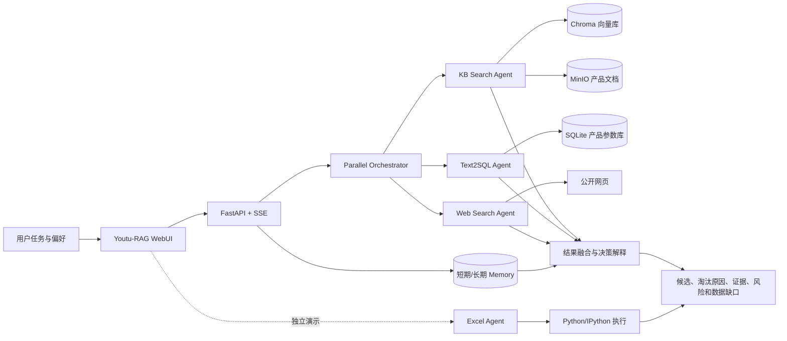
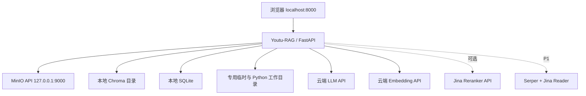

# 多源消费决策研究 Agent：最终开发交接总文档

> 项目中文名：多源消费决策研究 Agent  
> 项目英文名：SmartBuy Research Agent  
> 简历副标题：基于 Youtu-RAG 的多源 Agentic RAG 研究与决策系统  
> 目标岗位：Agent 应用 / 全栈工程师  
> 主参考仓库：[TencentCloudADP/youtu-rag](https://github.com/TencentCloudADP/youtu-rag)  
> 调研与交接快照日期：2026-08-26  
> 文档用途：将本文件移动到新开发目录后，交给新的开发 Agent 作为唯一入口文档

---

## 文档导航

如果只想快速接手，依次阅读：

1. 第 0–1 节：当前状态和不可随意改变的决策。
2. 第 5–6 节：上游真实能力、Agent 判定和不能夸大的边界。
3. 第 8–10 节：架构、数据和最终输出。
4. 第 11–13 节：当前 Windows 条件、部署与冒烟测试。
5. 第 14、17、23–24 节：开发计划、评测、完成定义和首日清单。

完整章节包括：背景定位、场景范围、仓库选择、功能优先级、架构、数据 Schema、Windows 部署、验收门槛、开发阶段、目录设计、最小创新点、评测、演示、风险、安全、测试、简历表达、Definition of Done、交接记录模板、未决问题与来源。

## 0. 给接手 Agent 的最重要说明

这不是一份已经完成开发的项目说明，而是一份经过岗位、场景、开源仓库和本机环境调研后形成的**开发规格与交接文档**。

接手后不要假设项目已经安装或运行。当前真实状态如下：

| 项目事项 | 当前状态 |
|---|---|
| 场景和技术路线 | 已确定 |
| 主参考仓库 | 已确定为 Youtu-RAG |
| Windows 本机环境盘点 | 已完成 |
| 上游 README、配置和部分关键源码核对 | 已完成 |
| Youtu-RAG 仓库克隆 | **尚未执行** |
| `uv sync` 依赖安装 | **尚未执行** |
| `.env` 创建和 API Key 配置 | **尚未执行** |
| MinIO 安装与启动 | **尚未执行** |
| LLM、Embedding、Reranker、Web Search 联调 | **尚未执行** |
| PDF 上传、知识库构建和向量化 | **尚未执行** |
| Excel、Text2SQL、Parallel Orchestrator、Memory 运行验证 | **尚未执行** |
| 项目代码修改 | **没有进行任何修改** |
| 场景数据集与评测集 | 只有规格，尚未采集和构建 |

因此，本文中关于仓库能力的描述分为三种证据等级：

- **源码或官方文档确认**：上游 README、配置或源码中明确存在。
- **方案推断**：根据代码结构判断可行，但尚未在当前电脑上运行。
- **待实测**：必须通过 Windows 冒烟测试后才能对外宣称。

任何简历数字、准确率提升、延迟、成本和成功率都必须来自后续真实实验，不能直接使用本文中的目标值或上游仓库 Benchmark 作为个人项目结果。

---

## 1. 技术结论：应该做什么

### 1.1 最终项目定义

本项目不是普通的“商品推荐聊天机器人”，而是一个面向复杂消费选择任务的**多源研究与决策 Agent**：

> 用户给出预算、用途、硬约束和软偏好后，系统自主选择知识库检索、结构化数据库查询、网页搜索和记忆等能力，核验不同来源中的事实，筛选候选产品，解释保留与淘汰原因，并输出带证据、风险和数据缺口的购买决策报告。

第一版聚焦“显示器选购”，示例任务为：

> 预算 2500 元，主要用于编程，偶尔玩 FPS，桌面宽度有限，不考虑 OLED。请结合官方说明书、参数数据库和公开网页资料，推荐两个型号，解释为什么淘汰其他候选，并标出关键事实来源和仍不确定的信息。

### 1.2 不可随意改变的核心决策

| 决策项 | 最终选择 | 原因 |
|---|---|---|
| 求职定位 | Agent 应用 / 全栈工程师 | 需要证明端到端 Agent 产品工程能力，而不是只做算法实验 |
| 项目场景 | 开放日常消费决策 | 数据公开、可复现、不依赖学校或企业内部接口 |
| 第一产品类别 | 显示器 | 官方说明书丰富、参数结构清晰、比较维度多、展示直观 |
| 技术主线 | Agentic RAG | 能体现自主路由、工具调用、结构化查询、记忆和反思 |
| 是否宣称 GraphRAG | 否 | 当前主仓库不是 GraphRAG，不能混淆概念 |
| 主仓库 | TencentCloudADP/youtu-rag | Python、较新、WebUI 完整、原生提供多种 Agent 和监控 |
| 运行环境 | Windows 原生 | 当前电脑已有 Python 3.12 和 uv，不先引入 WSL/Docker |
| 模型方案 | 云端 LLM + 云端 Embedding | GTX 960 仅 2 GB 显存，不适合本地 2B Embedding 或本地大模型 |
| 主结构化数据源 | SQLite | 可直接进入 Text2SQL 和默认并行编排器，较 Excel 更适合主闭环 |
| Excel 定位 | 独立能力演示和辅助分析 | 上游并行编排配置中的 Excel worker 默认被注释，先不把它设为主链路依赖 |
| 第一阶段是否改核心代码 | 否 | 先确认上游完整能力可运行，再判断是否需要最小改进 |
| 最终目标层级 | 场景化 Demo + 可复现实验 | 只运行原仓库不足以证明个人能力，数据、评测和工程交付必须完成 |

### 1.3 一句话技术方案

使用 Youtu-RAG 的知识库、KB Search、Text2SQL、Web Search、Parallel Orchestrator 和 Memory，把产品说明书、SQLite 参数库、网页资料及用户偏好组合成一个可追踪、可评测的消费决策 Agent；Excel Agent 作为半结构化数据分析的独立展示能力。

### 1.4 可行性结论

以下评分是基于当前硬件、上游依赖和源码结构的工程判断，不是运行测量结果：

| 目标 | 可行性判断 | 主要依据 |
|---|---:|---|
| Windows 启动 WebUI 和后端 | 高，约 8/10 | 官方列出 Windows；Python 和 uv 版本满足要求 |
| PDF/Markdown 知识库与 KB Search | 高，约 8/10 | ChromaDB、FAISS CPU 均有 Windows/Python 3.12 包；Embedding 使用云 API |
| SQLite + Text2SQL | 中高，约 7/10 | SQLite 本地可用，但仍需实测导入、Schema 理解与 SQL 执行 |
| KB + SQL + Web 并行编排 | 中高，约 7/10 | 上游已有 Parallel Orchestrator 配置和实现，但当前机器未运行验证 |
| Excel Agent | 中等，约 6.5–7/10 | Python 执行器使用 IPython，Windows 原理上可行；路径、文件下载和持久状态需实测 |
| Memory | 中等，约 7/10 | 上游存在短期与长期记忆开关，存储和跨会话行为需实测 |
| 完全本地模型部署 | 很低，约 2/10 | GTX 960 只有 2 GB；Youtu-Embedding 为 2B 参数模型 |
| 项目整体，采用云 API | 可行，约 7/10 | 最大风险是新仓库兼容性和多能力联调，不是基础硬件 |

建议为 Youtu-RAG 预留 **3–5 个完整开发日**。如果遇到 Windows 路径或执行器问题，再预留 1–2 天。这个工期不包含大规模人工数据标注。

---

## 2. 为什么这个项目适合 Agent 应用 / 全栈岗位

此前对中国多家大厂 Agent 岗位的归纳可以转化为以下项目证据要求。接手 Agent 应围绕这些证据开发，不要只追求功能数量。

| 岗位常见能力 | 本项目应提供的可验证证据 |
|---|---|
| Python 后端和 API 工程 | FastAPI 服务、SSE 流式响应、配置管理、错误处理、SQLite/MinIO/Chroma 接入 |
| Agent 工作流与工具调用 | KB Search、Text2SQL、Web Search、Excel、Memory 的选择和执行轨迹 |
| RAG 与检索工程 | 文档解析、分块、Embedding、向量检索、元数据筛选、Rerank、引用 |
| 多源信息整合 | 官方文档、结构化参数、网页信息和用户偏好共同参与决策 |
| 数据与业务建模 | 产品 Schema、约束定义、来源版本、价格时间戳、候选淘汰规则 |
| Eval 和可观测 | Golden Set、三种 Baseline、工具选择准确率、事实与证据指标、监控页面 |
| 产品化与前端 | 可操作 WebUI、文件和知识库管理、流式过程、最终决策展示 |
| 稳定性和安全意识 | API 失败降级、动态网页不稳定、代码执行风险、秘密管理、单用户边界 |
| 技术选型和边界判断 | 解释为何主线是 Agentic RAG、为何不把 GraphRAG 和本地模型同时加入第一版 |

真正值得在面试中讲的不是“用了多少 Agent”，而是：

1. 为什么某类问题要检索文档、查数据库或访问网页。
2. 如何保证硬约束不被语言模型忽略。
3. 如何追踪答案中的事实来自哪里。
4. 工具或来源失败时如何降级。
5. Agentic 路由是否真的优于固定 RAG，以及用什么实验得到结论。

---

## 3. 场景与产品范围

### 3.1 目标用户

- 想购买参数复杂产品、但不愿手动阅读大量资料的普通消费者。
- 需要比较多个候选型号、验证约束并保留事实证据的数码爱好者。
- 希望系统记住长期偏好，例如预算风格、品牌排除项、尺寸限制的重复使用者。

### 3.2 第一版为什么选显示器

显示器具有以下优势：

- 官方产品页、用户手册和规格 PDF 较容易公开获取。
- 价格、尺寸、分辨率、刷新率、面板、接口、支架和保修等字段明确。
- 同时存在非结构化文档、结构化参数、时效性价格与个人偏好，适合多源 Agent。
- “满足硬条件”和“根据软偏好排序”可以清楚区分。
- 不属于医疗、法律或金融等高风险决策，演示风险较低。

第一版不要同时覆盖手机、电脑、路由器、相机和家电。先把一个类别的纵向闭环做完整，再考虑抽象通用 Schema。

### 3.3 核心用户故事

#### 用户故事 A：单一文档事实核验

用户问：某型号的 USB-C 是否支持视频输入和 90W 供电？

预期：Agent 使用 KB Search 找到官方说明书相关片段，给出答案和来源；没有证据时明确说无法确认。

#### 用户故事 B：结构化约束筛选

用户问：2500 元以内、27 英寸、4K、支持 USB-C 且升降支架的型号有哪些？

预期：Agent 使用 Text2SQL 查询 SQLite，展示满足和不满足条件的候选，不依靠模型心算筛选。

#### 用户故事 C：多源复杂研究

用户问：在给定预算和用途下推荐两个型号，并结合说明书、参数表和当前网页信息解释。

预期：Parallel Orchestrator 调度 KB Search、Text2SQL 和 Web Search，汇总候选、证据、淘汰原因和风险。

#### 用户故事 D：表格分析

用户上传一份型号参数 Excel，要求计算满足条件的型号、性价比指标或缺失字段分布。

预期：Excel Agent 分解问题、生成 Python、执行并根据结果反思；过程可在前端看到。

#### 用户故事 E：偏好记忆

第一轮用户说明“不接受 OLED，桌面宽度不超过 1200 mm”。后续询问新候选时不重复输入。

预期：短期记忆在当前会话生效；长期记忆是否跨会话复用必须实测并保留证据。

#### 用户故事 F：证据不足与冲突

数据库价格与网页价格时间不同，或者官方手册未说明某功能。

预期：系统显示来源时间，优先把官方资料用于稳定规格，把网页用于时效信息；不强行得出确定结论。

### 3.4 明确不做的内容

- 不做自动下单、支付、抢购、返利或电商账户操作。
- 不抓取需要登录、绕过验证码或违反网站条款的数据。
- 不把社交媒体主观评价当作确定事实。
- 不保证实时价格；价格必须带 `observed_at` 时间。
- 不在第一版训练或微调 LLM、Embedding 模型。
- 不在第一版同时引入 GraphRAG、Neo4j 和知识图谱构建。
- 不把 LLM 生成的 Python 代码执行器对公网开放。
- 不声称系统适合多租户生产环境。

---

## 4. 参考仓库与技术选择

### 4.1 主仓库：Youtu-RAG

仓库地址：[TencentCloudADP/youtu-rag](https://github.com/TencentCloudADP/youtu-rag)

选择理由：

- 2026 年发布，时间较新，定位就是 Agentic RAG。
- MIT License，便于 Fork、修改和展示，但必须保留上游许可和归属。
- Python 3.12+，后端为 FastAPI，当前电脑版本匹配。
- 自带纯 HTML/CSS/JavaScript WebUI，无需单独构建大型前端工程。
- 自带文件管理、知识库管理、文档预览、流式对话和 `/monitor`。
- 官方提供 Chat、Web Search、KB Search、Meta Retrieval、File QA、Excel、Text2SQL、并行编排等 Agent。
- 有短期会话记忆、长期经验记忆和 QA Learning 设计。
- 上游 README 提供 Excel、Text2SQL、长文档和元数据检索 Benchmark；这些只能作为仓库背景，不能当作个人项目结果。

关键上游文件：

- [中文 README](https://github.com/TencentCloudADP/youtu-rag/blob/main/README_ZH.md)
- [依赖与 Python 版本](https://github.com/TencentCloudADP/youtu-rag/blob/main/pyproject.toml)
- [环境变量示例](https://github.com/TencentCloudADP/youtu-rag/blob/main/.env.example)
- [前端 Agent 映射与选择配置](https://github.com/TencentCloudADP/youtu-rag/blob/main/configs/rag/frontend_agents.yaml)
- [默认 RAG 配置](https://github.com/TencentCloudADP/youtu-rag/blob/main/configs/rag/default.yaml)
- [KB Search 工具配置](https://github.com/TencentCloudADP/youtu-rag/blob/main/configs/rag/rag_tools/kb_search.yaml)
- [Meta Retrieval 工具配置](https://github.com/TencentCloudADP/youtu-rag/blob/main/configs/rag/rag_tools/meta_retrieval.yaml)
- [并行编排配置](https://github.com/TencentCloudADP/youtu-rag/blob/main/configs/agents/orchestrator/parallel.yaml)
- [聊天服务和不同 Agent 的上下文注入](https://github.com/TencentCloudADP/youtu-rag/blob/main/utu/rag/api/services/chat_service.py)
- [Python 执行器](https://github.com/TencentCloudADP/youtu-rag/blob/main/utu/tools/python_executor_toolkit.py)
- [Embedding 工厂](https://github.com/TencentCloudADP/youtu-rag/blob/main/utu/rag/embeddings/factory.py)
- [Reranker 工厂](https://github.com/TencentCloudADP/youtu-rag/blob/main/utu/rag/rerankers/factory.py)

### 4.2 底层 Agent 框架参考

Youtu-RAG 基于同组织的 [TencentCloudADP/youtu-agent](https://github.com/TencentCloudADP/youtu-agent)。如果需要理解模型配置、工具注册、Agent 基类、编排器或 Memory，应继续阅读该仓库，但不要在第一天同时重构两个仓库。

### 4.3 成熟兜底：Kotaemon

兜底仓库：[Cinnamon/kotaemon](https://github.com/Cinnamon/kotaemon)

它具有完整 WebUI、文档问答、混合检索、引用与文档预览，以及问题分解、ReAct、ReWOO 等高级 RAG 能力。它更成熟，适合作为“Youtu-RAG 在 Windows 两天内无法跑通基础链路”时的替代底座。

切换到 Kotaemon 不代表项目场景和评测设计全部作废：显示器资料、产品数据库、问题集、输出格式和 Baseline 仍然可以复用。切换时应重写架构部分，不要继续宣称使用 Youtu-RAG 的原生多 Agent 和双层记忆。

### 4.4 GraphRAG 备选但不进入当前版本

如果以后明确把主线改成图检索，可以重新评估 [TencentCloudADP/youtu-graphrag](https://github.com/TencentCloudADP/youtu-graphrag)。该项目面向图增强复杂推理，包含 schema-guided hierarchy 和 agentic retrieval 等研究设计。

当前项目不要把它作为“顺手增加”的功能，原因是：

- 图谱构建、Schema、图数据库或图索引会显著增加环境和数据治理成本。
- 消费决策第一版通过文档检索 + SQL 约束查询已经能形成自然 Agent 闭环。
- 如果没有 GraphRAG 与向量 RAG 的真实对比实验，它只会增加名词而不是项目证据。

### 4.5 不选 TigerGraph GraphRAG 的原因

TigerGraph 路线需要更重的数据库和常见 Docker 配置。当前 Windows 没有 Docker，且第一目标是尽快获得稳定可展示的 Agent 产品，因此不采用。

---

## 5. 上游原生能力、项目工作和待验证边界

### 5.1 能力归属表

| 能力 | 上游原生 | 本项目需要做什么 | 运行状态 |
|---|---|---|---|
| 文件上传与预览 | 是 | 准备产品资料并规范命名、来源和元数据 | 待实测 |
| 知识库管理与向量化 | 是 | 建立“显示器官方资料库” | 待实测 |
| KB Search | 是 | 设计事实核验问题和引用规范 | 待实测 |
| Meta Retrieval | 是 | 写入发布时间、官方来源、品牌、型号等元数据 | 待实测 |
| Web Search | 是 | 配置 Serper/Jina，限制为当前信息补充 | 待实测 |
| Excel Agent | 是 | 准备规范 Excel 和分析问题 | 待实测 |
| Text2SQL | 是 | 构建产品 SQLite，定义稳定 Schema 和测试问题 | 待实测 |
| Parallel Orchestrator | 是 | 使用 KB + Text2SQL + Web 形成多源研究任务 | 待实测 |
| Excel 进入并行编排 | 配置中默认注释 | 可选小改：启用 worker 并修正文件上下文传递 | 未验证，不是 P0 |
| 短期/长期 Memory | 是 | 设计偏好写入与复用测试 | 待实测 |
| 流式过程和 Monitor | 是 | 截图、记录工具路径、导出测试证据 | 待实测 |
| 消费决策场景数据 | 否 | 采集、清洗、建模、记录许可和时间 | 未开始 |
| 结构化输出模板 | 否 | 通过提示词或最小后处理实现 | 未开始 |
| 硬约束确定性复核 | 否 | 推荐的最小创新点，P1 才考虑 | 未开始 |
| 项目专属评测集 | 否 | 建立 30–100 条任务与 Baseline | 未开始 |
| 消费决策可视化卡片 | 否 | 时间充足时改前端 | 未开始 |

### 5.2 上游并行编排器的真实边界

根据上游 `configs/agents/orchestrator/parallel.yaml`：

- 默认 worker 包含 `KBSearch`、`Text2SQL` 和 `WebSearch`。
- `ExcelQA` worker 代码行存在，但默认被注释。
- 默认最大并行数为 4，单任务超时为 600 秒。
- 编排器会为子任务分配不同 worker 并融合结果，源码和 SSE 服务也有并行事件类型。

这带来一个重要实现决策：

> 主演示中的结构化产品参数应优先存入 SQLite，并使用 Text2SQL；Excel 保留为独立展示。这样无需先改核心代码，就可以演示真正的“文档 + 数据库 + Web”多源 Agent。

只有在基础版本稳定后，才尝试取消 Excel worker 注释并验证文件路径、知识库文件下载、并行上下文和结果融合。不能因为配置里有一行注释就提前声称“并行 Excel 编排已完成”。

### 5.3 Agent 选择的并发边界

上游 Agent 切换服务会设置进程级环境变量并重置当前 Agent；Excel 文件路径也通过环境变量传递。这个设计适合本地单用户 Demo，但对多用户并发存在全局状态风险。

因此：

- 服务只绑定 `127.0.0.1`。
- 第一版按单用户、单进程运行。
- 不把它描述为多租户 SaaS。
- 如果后续要部署到公网，必须先把当前 Agent、文件路径和执行状态改成请求级或会话级隔离。

### 5.4 Python 执行器不是安全沙箱

源码中的 Python Executor 使用持久化 IPython 实例直接执行模型生成代码，并允许读写工作目录。它虽然有超时，但没有提供强进程、容器、权限或网络隔离。

因此：

- 只处理自己准备的可信 Excel 和提示词。
- 不允许陌生公网用户提交任意文件或指令。
- 不在管理员权限终端运行服务。
- 为执行器设置专用工作目录。
- 演示数据中不放任何敏感文件、Token 或个人隐私。
- 简历中写“受限工作目录和超时控制”之前，必须真正实现；不要直接称它为“安全沙箱”。

### 5.5 Reranker 的降级行为和配置不一致

上游工具在 Reranker 初始化失败时会记录错误并退化为纯 Embedding 结果，这是有利的失败策略。但当前配置中可见 `UTU_RERANKER_URL` 与 `UTU_RERANKER_BASE_URL` 两种变量名并存的迹象。

建议：

- 第一次启动允许不配 Reranker，先确认向量链路。
- 正式启用时，在 `.env` 中将两个变量都设为同一个 Jina base URL。
- 用日志和一条明确测试确认返回结果含 `reranked: true`，不能仅看配置判断已生效。

---

## 6. 这是否真的具备 Agent 能力

### 6.1 判定标准

本项目采用以下标准区分 Agent 与普通 RAG：

| Agent 能力 | 项目中的对应行为 | 判定 |
|---|---|---|
| 目标理解 | 从自然语言提取预算、用途、硬约束和软偏好 | 有 |
| 行动选择 | 判断用 KB、SQL、Web、Excel 或 Memory | 有，需实测路由质量 |
| 任务分解 | Text2SQL、Excel、Parallel Orchestrator 都有分解设计 | 有 |
| 工具调用 | 执行向量检索、SQL、网页检索、Python | 有 |
| 环境反馈 | 使用检索结果、SQL 结果、代码输出继续回答 | 有 |
| 反思/修正 | Excel 和 Text2SQL 官方说明中有 reflection | 有，需实测 |
| 记忆 | 短期会话 + 长期经验 | 有，需实测语义和持久化 |
| 多 Agent 协作 | Parallel Orchestrator 默认含三个 worker | 有，需运行验证 |
| 引用和证据 | 检索结果包含来源元数据，但最终逐句引用质量需评测 | 部分具备 |
| 硬约束确定性保证 | 上游主要依赖 Agent 和 SQL，无项目专属复核器 | 当前不足 |
| 人工审批 | 当前场景只读，不是重点 | 不突出 |
| 强安全隔离 | Python 执行器不是强沙箱 | 不具备 |

### 6.2 为什么不是普通 RAG

固定 RAG 通常是“切分 → 向量搜索 → 拼接 → 生成”的单路径。本项目的复杂任务可以：

1. 把产品稳定规格交给知识库检索。
2. 把硬约束筛选和计算交给 SQLite/Text2SQL。
3. 把当前价格或新发布信息交给 Web Search。
4. 并行执行不同子任务并融合。
5. 根据会话或长期记忆复用用户偏好。
6. 在工具失败或信息不足时返回降级结果和不确定性。

这些行为构成 Agentic RAG，但并不自动保证每一次路由都正确，所以必须评测。

### 6.3 为什么当前不能写 GraphRAG

Youtu-RAG 当前主线是向量检索、元数据检索、结构化查询和 Agent 编排，不等同于图检索。除非后续实际集成图构建、图查询或 Youtu-GraphRAG，并完成对比实验，否则项目标题、README、简历和面试均不得写 GraphRAG。

---

## 7. 功能需求与优先级

### 7.1 P0：必须完成，否则项目不成立

#### P0-1 基础服务

- Windows 原生完成依赖安装。
- MinIO、SQLite、Chroma 和 FastAPI 正常启动。
- WebUI 可访问，SSE 流式回答正常。
- `/monitor` 能看到至少一次请求或工具事件。

#### P0-2 产品资料管理

- 上传 10–20 份文本型 PDF/Markdown 官方资料。
- 每份文件记录品牌、型号、来源 URL、发布日期、是否官方和校验值。
- 建立“显示器官方资料库”。
- 知识库构建成功，重启后数据仍存在。

#### P0-3 文档检索

- KB Search 能回答至少 10 条单文档事实题。
- 答案保留来源文件名或 URL。
- 对资料中不存在的事实能明确说明证据不足。

#### P0-4 结构化查询

- 建立包含 10–15 个型号的 SQLite 产品数据库。
- Text2SQL 能执行预算、分辨率、接口、尺寸等组合筛选。
- SQL 结果与人工查询一致。

#### P0-5 多源 Agent

- Parallel Orchestrator 至少完成一条 KB + Text2SQL 的复合任务。
- 配置 Web Search 后完成一条 KB + Text2SQL + Web 的复合任务。
- 前端或日志能看到 worker/工具执行过程。

#### P0-6 项目化交付

- 有项目 README、架构、数据说明、运行步骤和演示脚本。
- `.env`、API Key、MinIO 密码不进入 Git。
- 记录上游 commit、Python/uv 版本和实际模型名称。

### 7.2 P1：推荐完成，形成秋招差异化

- 30–50 条可复现测试任务。
- 对比 Direct LLM、固定 KB Search、Agentic RAG 三种方案。
- 提供工具选择、硬约束、事实和证据指标。
- 启用并验证 Reranker。
- 启用并验证短期/长期 Memory。
- 独立演示 Excel Agent 的问题分解、代码执行和反思。
- 输出统一的决策报告结构。
- 增加硬约束确定性复核器，或至少用 SQL 二次检查最终候选。
- 记录失败案例和修复前后结果。

### 7.3 P2：时间充足再做

- 把 Excel worker 接入 Parallel Orchestrator。
- 增加消费决策专用 Agent 配置和提示词。
- 产品对比卡片、工具路径、延迟和成本前端面板。
- 逐句证据引用和来源冲突提示。
- 自动化 Eval CLI 和 HTML/Markdown 评测报告。
- 60–100 条测试任务、消融实验和多次重复测量。
- 第二商品类别，例如路由器，用于验证方案可迁移性。

### 7.4 明确不应优先的 P3

- 本地部署 2B Embedding。
- 自训练模型。
- 完整 GraphRAG。
- 大规模爬虫。
- 多租户、权限系统、支付和电商账户联动。
- 为了“全栈”而重写整个上游前端。

---

## 8. 推荐系统架构

### 8.1 逻辑架构



### 8.2 Windows 部署拓扑



### 8.3 数据源责任划分

| 数据源 | 负责回答什么 | 不负责什么 |
|---|---|---|
| 官方 PDF/Markdown 知识库 | 稳定规格、接口说明、功能限制、保修条款 | 当前价格和主观口碑 |
| SQLite 参数库 | 硬条件筛选、排序、计数、简单计算、价格快照 | 长文本解释和未录入事实 |
| Web Search | 当前价格、发布日期后的变化、公开补充资料 | 取代官方说明书作为稳定规格真相源 |
| Excel | 上传表格的探索、清洗、统计和临时计算 | 第一版的默认跨源主编排 |
| Memory | 用户偏好、成功处理经验、上下文 | 产品事实的权威来源 |

### 8.4 信息冲突优先级

对于稳定规格，默认优先级为：

1. 官方说明书或官方支持文档。
2. 官方产品页。
3. 可信零售商参数页。
4. 评测媒体。
5. 论坛或用户评论。

对于价格和库存，必须同时考虑时间戳，较新的可信来源优先。不同地区、不同版本和促销价不能直接视为矛盾，必须保留地区、版本和观察时间。

---

## 9. 数据设计

### 9.1 初始数据规模

MVP 推荐：

- 10–15 个显示器型号。
- 10–20 份官方 PDF/Markdown 文档。
- 1 个规范化 SQLite 数据库。
- 1 份对应 Excel/CSV，供 Excel Agent 演示。
- 30–50 条第一版测试问题。
- 5–10 条证据不足、来源冲突或工具失败问题。

最终秋招版本可扩展到 60–100 条测试，但不要为了数量牺牲标注质量。

### 9.2 文档元数据

每份文档至少记录：

```json
{
  "doc_id": "monitor_dell_u2723qe_manual_2024_en",
  "brand": "Dell",
  "model": "U2723QE",
  "product_category": "monitor",
  "source_type": "official_manual",
  "source_url": "https://example.com/manual.pdf",
  "published_at": "2024-01-01",
  "effective_at": "2024-01-01",
  "official": true,
  "language": "en",
  "version": "A01",
  "region": "CN",
  "checksum": "sha256:...",
  "license_note": "仅用于本地研究，不随仓库重新分发"
}
```

字段意义：

- `published_at`：来源发布日期。
- `effective_at`：规格或条款开始适用时间，未知则为空。
- `version`：手册或产品修订版本。
- `checksum`：后续确认文件没有变化。
- `license_note`：防止误把有版权限制的 PDF 提交到公开仓库。

### 9.3 SQLite Schema

第一版至少包含三张表。

#### `products`

```sql
CREATE TABLE products (
    model_id TEXT PRIMARY KEY,
    brand TEXT NOT NULL,
    model TEXT NOT NULL,
    product_category TEXT NOT NULL DEFAULT 'monitor',
    screen_size_in REAL,
    resolution_width INTEGER,
    resolution_height INTEGER,
    refresh_hz REAL,
    panel_type TEXT,
    oled INTEGER NOT NULL DEFAULT 0,
    usb_c INTEGER,
    usb_c_power_w REAL,
    hdmi_version TEXT,
    dp_version TEXT,
    height_adjustable INTEGER,
    width_mm REAL,
    weight_kg REAL,
    warranty_years REAL,
    release_date TEXT,
    official_source_url TEXT,
    source_updated_at TEXT
);
```

#### `price_observations`

```sql
CREATE TABLE price_observations (
    observation_id INTEGER PRIMARY KEY AUTOINCREMENT,
    model_id TEXT NOT NULL,
    price_cny REAL NOT NULL,
    seller TEXT,
    region TEXT DEFAULT 'CN',
    in_stock INTEGER,
    source_url TEXT NOT NULL,
    observed_at TEXT NOT NULL,
    price_type TEXT,
    FOREIGN KEY (model_id) REFERENCES products(model_id)
);
```

#### `source_records`

```sql
CREATE TABLE source_records (
    source_id TEXT PRIMARY KEY,
    model_id TEXT,
    source_type TEXT NOT NULL,
    title TEXT,
    source_url TEXT NOT NULL,
    official INTEGER NOT NULL DEFAULT 0,
    published_at TEXT,
    retrieved_at TEXT NOT NULL,
    checksum TEXT,
    notes TEXT,
    FOREIGN KEY (model_id) REFERENCES products(model_id)
);
```

不要只在 `products` 中保留一个会不断覆盖的 `price_cny`。价格有时效性，应进入观察表。为简化演示，可以创建视图返回每个型号最新一次价格：

```sql
CREATE VIEW latest_prices AS
SELECT p.*
FROM price_observations p
JOIN (
    SELECT model_id, MAX(observed_at) AS max_observed_at
    FROM price_observations
    GROUP BY model_id
) latest
ON p.model_id = latest.model_id
AND p.observed_at = latest.max_observed_at;
```

### 9.4 Excel/CSV 字段

供 Excel Agent 使用的单表至少包含：

```text
model_id
brand
model
price_cny
screen_size_in
resolution
refresh_hz
panel_type
oled
usb_c
usb_c_power_w
hdmi_version
dp_version
height_adjustable
width_mm
warranty_years
release_date
source_url
observed_at
```

布尔字段统一使用 `0/1` 或 `true/false`，不要混用“是/支持/有/√”。缺失值为空，不要用 `0` 表示未知。

### 9.5 用户偏好模型

```json
{
  "user_id": "demo_user",
  "budget_max_cny": 2500,
  "use_cases": ["programming", "casual_fps"],
  "hard_constraints": {
    "oled": false,
    "screen_size_in": 27,
    "desk_width_mm_max": 1200
  },
  "soft_preferences": [
    "usb_c_power_delivery",
    "height_adjustable",
    "text_clarity"
  ],
  "excluded_brands": [],
  "updated_at": "2026-08-26T00:00:00+08:00"
}
```

硬约束和软偏好必须分开。硬约束违反时直接淘汰；软偏好只影响排序和解释。

### 9.6 评测样本格式

推荐 JSONL：

```json
{
  "case_id": "multi_source_001",
  "question": "预算2500元，27英寸4K，必须支持USB-C供电，推荐两个型号。",
  "category": "multi_source_decision",
  "required_tools": ["kb_search", "text2sql"],
  "hard_constraints": {
    "price_cny_lte": 2500,
    "screen_size_in_eq": 27,
    "resolution_eq": "3840x2160",
    "usb_c_eq": true
  },
  "gold_facts": [
    {"subject": "model_x", "predicate": "usb_c", "value": true}
  ],
  "gold_sources": ["doc_id_or_url"],
  "expected_behavior": "只推荐满足全部硬约束的候选，并给出来源。",
  "should_abstain": false
}
```

### 9.7 数据质量规则

- 每个关键规格至少有一个来源 URL。
- 官方来源与非官方来源分开标记。
- 所有价格必须有 `observed_at`。
- 型号命名统一大小写、空格和后缀。
- 不同地区版本单独建记录，不强行合并。
- 未知与“不支持”严格区分。
- 每次修改数据库后运行约束检查和人工抽查。
- 如果 PDF 版权不允许再分发，公开仓库只提交来源清单、采集脚本、校验值和少量自制摘要。

---

## 10. 最终输出规格

### 10.1 面向用户的结构

复杂决策回答至少包含：

1. 对需求的理解。
2. 硬约束和软偏好。
3. 数据来源及其时间。
4. 推荐候选与排序。
5. 每个候选满足哪些条件。
6. 被淘汰候选及淘汰原因。
7. 关键证据或来源。
8. 来源冲突、缺失信息和风险。
9. 下一步建议，例如到手后确认接口或保修地区。

### 10.2 推荐结构化输出

```json
{
  "request_summary": "预算2500元，编程为主，偶尔FPS，排除OLED",
  "constraints": {
    "hard": [],
    "soft": []
  },
  "sources_used": [
    {
      "source_type": "official_manual",
      "title": "...",
      "url": "...",
      "observed_or_published_at": "..."
    }
  ],
  "recommended": [
    {
      "model_id": "...",
      "rank": 1,
      "why": [],
      "constraint_check": {},
      "evidence": [],
      "risks": []
    }
  ],
  "eliminated": [
    {
      "model_id": "...",
      "reason": "违反价格硬约束"
    }
  ],
  "uncertainties": [],
  "trace_summary": {
    "tools_used": [],
    "failed_tools": [],
    "fallbacks": []
  }
}
```

上游默认输出未必严格符合该 JSON。V0 可以用提示词约束 Markdown 结构；P1 再考虑 Pydantic 校验或确定性后处理。

### 10.3 场景提示词草案

```text
你是多源消费决策研究 Agent。你的任务不是直接生成主观推荐，而是先核验事实、筛选约束，再给出有证据的结论。

工作原则：
1. 首先区分硬约束与软偏好。违反任一硬约束的候选不得推荐。
2. 稳定产品规格优先使用官方文档或产品知识库。
3. 数值筛选、排序和计算优先查询结构化数据库，不依靠心算。
4. 当前价格、库存或近期变化才使用 Web Search，并标出查询时间。
5. 同一事实存在冲突时，列出双方来源，不静默选择。
6. 找不到证据时明确写“无法确认”，不要用常识补齐。
7. 输出推荐候选、淘汰候选、关键证据、风险和数据缺口。
8. 不进行购买、支付或账户操作。
```

若使用 Parallel Orchestrator，应让它明确拆分为“文档事实核验”“数据库约束筛选”“当前网页补充”三个子任务。

---

## 11. 当前 Windows 电脑环境

以下信息于 2026-08-26 在本机实际读取：

| 项目 | 当前值 | 影响 |
|---|---|---|
| 操作系统 | Windows 11 家庭版，Build 26200 | 上游官方列出支持 Windows |
| CPU | Intel Core i5-10400F @ 2.90 GHz | 足以运行 Web 服务、Chroma、SQLite 和小规模数据处理 |
| 内存 | 31.9 GB | 足以运行本地服务和 MinIO；检查时约 17.7 GB 可用 |
| GPU | NVIDIA GTX 960，2048 MiB | 不适合本地 2B Embedding 或本地 LLM |
| Python | 3.12.3 | 满足上游 `>=3.12` |
| uv | 0.12.3 | 可直接使用上游推荐安装方式 |
| Node.js | v24.15.0 | Youtu-RAG 前端是原生静态页面，通常不需要 Node 构建 |
| C 盘剩余空间 | 56.6 GB | 云 API 路线足够；不适合无规划下载多个本地大模型 |
| Docker | 未安装 | 初期不需要安装 |
| WSL | 未安装/未配置可用发行版 | 初期不需要安装 |
| Windows Long Paths | `LongPathsEnabled=0` | 必须使用短路径，建议设置仓库级 Git longpaths |
| 当前文档目录 | 含中文且层级较深 | 不建议在此目录直接开发 |

### 11.1 推荐开发路径

优先选择：

```text
C:\ai\youtu-rag
C:\ai\minio
C:\ai\minio-data
```

若 D 盘空间更充足，可改为：

```text
D:\ai\youtu-rag
D:\ai\minio
D:\ai\minio-data
```

不要把代码放在当前含中文且较深的秋招资料路径中。Python 包、MinIO、模型服务、临时目录和部分第三方脚本对中文、空格和长路径的兼容性不一致。

### 11.2 模型部署判断

[Youtu-Embedding](https://github.com/TencentCloudADP/youtu-embedding) 官方模型为 2B 参数、2048 维。2 GB GPU 显存无法提供实用的本地推理体验；CPU 虽可能运行，但加载和批量向量化时间不适合稳定演示。

第一版必须使用：

- 云端 OpenAI-compatible LLM，例如上游示例中的 DeepSeek。
- 云端 Embedding，优先使用上游 `.env.example` 明确示例的混元 Embedding API。
- Reranker 第一轮可不配，基础检索成功后再接 Jina。

当前 PyPI 上的 [faiss-cpu](https://pypi.org/project/faiss-cpu/) 和 [chromadb](https://pypi.org/project/chromadb/) 提供 Windows/Python 3.12 兼容发行物，但仍必须以 `uv sync` 的真实结果为准。

---

## 12. Windows 原生部署步骤

> 本节是建议操作，不代表已经执行成功。接手 Agent 必须逐步运行并记录结果，不要一次启用全部服务。

### 12.1 第一步：创建短路径并克隆

在普通用户权限 PowerShell 中：

```powershell
New-Item -ItemType Directory -Force -Path C:\ai
git clone https://github.com/TencentCloudADP/youtu-rag.git C:\ai\youtu-rag
Set-Location C:\ai\youtu-rag
git config core.longpaths true
git rev-parse HEAD
```

把 `git rev-parse HEAD` 输出记录到项目文档。不要直接假设本文调研时的 main 分支和开发时完全一致。

如果有自己的 GitHub Fork，推荐：

```powershell
git remote rename origin upstream
git remote add origin https://github.com/<YOUR_GITHUB_NAME>/<YOUR_FORK>.git
git switch -c feat/smartbuy-agent
```

如果尚未 Fork，先完成本地冒烟测试，不必把“创建远程仓库”作为第一步阻塞项。

### 12.2 第二步：安装依赖

优先使用锁文件：

```powershell
Set-Location C:\ai\youtu-rag
uv sync --frozen
```

如果上游锁文件与当前平台无法解析，保留完整错误，再尝试官方文档命令：

```powershell
uv sync
```

验证关键导入：

```powershell
uv run python -c "import fastapi, chromadb, faiss, pandas, openpyxl; print('imports-ok')"
```

Windows 下不需要执行 Linux 命令 `source .venv/bin/activate`。可以始终用 `uv run ...`，避免 PowerShell Execution Policy 对激活脚本的影响。

依赖安装后记录：

```powershell
uv run python --version
uv tree > uv-tree.txt
```

`uv-tree.txt` 可以放在本地调试目录；是否提交仓库由后续决定。

### 12.3 第三步：安装并启动 MinIO

Youtu-RAG 使用 MinIO 存储上传文件。Windows 可参考 [MinIO Windows 官方文档](https://docs.min.io/aistor/installation/windows/)。

建议目录：

```powershell
New-Item -ItemType Directory -Force -Path C:\ai\minio
New-Item -ItemType Directory -Force -Path C:\ai\minio-data
```

将兼容的 `minio.exe` 放入 `C:\ai\minio`。在单独 PowerShell 窗口运行：

```powershell
Set-Location C:\ai\minio
$env:MINIO_ROOT_USER = "smartbuy_admin"
$env:MINIO_ROOT_PASSWORD = "<A_LONG_LOCAL_PASSWORD>"
.\minio.exe server C:\ai\minio-data --console-address ":9001"
```

预期：

- S3 API：`http://127.0.0.1:9000`
- Console：`http://127.0.0.1:9001`

健康检查：

```powershell
Invoke-WebRequest http://127.0.0.1:9000/minio/health/live
```

开发阶段保持 MinIO 终端运行。不要把真实密码写进公开 README、截图或 Git 历史。

### 12.4 第四步：创建 `.env`

```powershell
Set-Location C:\ai\youtu-rag
Copy-Item .env.example .env
```

建议第一轮模板如下，尖括号内容必须替换；不要把 `.env` 提交 Git：

```dotenv
# Local server only
SERVER_HOST=127.0.0.1
SERVER_PORT=8000

# LLM: use an OpenAI-compatible cloud service
UTU_LLM_TYPE=chat.completions
UTU_LLM_MODEL=deepseek-chat
UTU_LLM_BASE_URL=https://api.deepseek.com/v1
UTU_LLM_API_KEY=<YOUR_LLM_API_KEY>

# Web tools: leave empty during the first KB smoke test
SERPER_API_KEY=
JINA_API_KEY=

# OCR: disabled in the first phase
UTU_OCR_BASE_URL=
UTU_OCR_MODEL=youtu-ocr

# Embedding: use the provider explicitly documented by upstream first
UTU_EMBEDDING_URL=https://api.hunyuan.cloud.tencent.com/v1
UTU_EMBEDDING_API_KEY=<YOUR_EMBEDDING_API_KEY>
UTU_EMBEDDING_MODEL=hunyuan-embedding

# Reranker: optional at first; when enabled set BOTH URL names
UTU_RERANKER_MODEL=jina-reranker-v3
UTU_RERANKER_URL=https://api.jina.ai/v1
UTU_RERANKER_BASE_URL=https://api.jina.ai/v1
UTU_RERANKER_API_KEY=

# Local storage monitoring
ENABLE_VECTOR_MONITOR=true
VECTOR_STORE_PATH=./rag_data/vector_store_hunyuan_1024
ENABLE_MINIO_MONITOR=true

# MinIO
MINIO_ENDPOINT=127.0.0.1:9000
MINIO_ACCESS_KEY=smartbuy_admin
MINIO_SECRET_KEY=<THE_SAME_MINIO_PASSWORD>
MINIO_BUCKET=ufile
MINIO_BUCKET_SYS=sysfile
MINIO_SECURE=false
MINIO_LOCAL_TMP_DIR=C:/ai/youtu-rag/rag_data/minio_tmp

# SQLite system DB
UTU_DB_URL=sqlite:///./rag_data/relational_database/rag_demo.sqlite

# Optional tracing
PHOENIX_ENDPOINT=
PHOENIX_PROJECT_NAME=smartbuy_youtu_rag
PHOENIX_API_KEY=

UTU_LOG_LEVEL=INFO

# Enable only after basic RAG works
memoryEnabled=false
MEMORY_STORE_PATH=./rag_data/memory_data
```

为什么 `VECTOR_STORE_PATH` 带模型维度：不同 Embedding 模型可能产生不同维数，不能把 1024 维和 2048 维向量写进同一旧索引。如果切换模型，使用新的版本化目录并重建知识库，不要盲目删除已有数据。

### 12.5 第五步：修改 Windows 和 API 相关配置

#### 关闭 OCR 和 HiChunk

编辑：

```text
configs/rag/file_management.yaml
```

第一阶段设置：

```yaml
ocr:
  enabled: false

chunk:
  enabled: false
```

只使用可复制文字的 PDF 或 Markdown。扫描 PDF 等基础链路稳定后再处理。

#### 设置 API Embedding

编辑 `configs/rag/default.yaml`，把默认本地 Embedding 改成 API 配置：

```yaml
embedding:
  display_name: "🔢 向量嵌入 (Embedding)"
  type: "api"
  model: "${UTU_EMBEDDING_MODEL}"
  base_url: "${UTU_EMBEDDING_URL}"
  api_key: "${UTU_EMBEDDING_API_KEY}"
  batch_size: 16
```

然后检查并修改：

```text
configs/rag/rag_tools/kb_search.yaml
configs/rag/rag_tools/meta_retrieval.yaml
```

将 `embedding.backend` 从 `service` 改成 `openai`，并提供 model、api_key 和 base_url：

```yaml
embedding:
  backend: openai
  model: ${oc.env:UTU_EMBEDDING_MODEL}
  api_key: ${oc.env:UTU_EMBEDDING_API_KEY}
  base_url: ${oc.env:UTU_EMBEDDING_URL}
```

修改后用以下命令复核所有相关配置，防止漏掉某处默认 `local/service`：

```powershell
rg -n "embedding:|backend: service|type: local|UTU_EMBEDDING" configs utu
```

上游存在一个使用第三方 SiliconFlow Embedding 时 endpoint 不兼容的公开 [Issue #11](https://github.com/TencentCloudADP/youtu-rag/issues/11)。因此第一轮优先使用 `.env.example` 明确给出的混元标准接口；其他 OpenAI-compatible 服务必须先用最小请求验证 endpoint 和模型名。

#### 为 Python Executor 设置 Windows 工作目录

编辑：

```text
configs/tools/python_executor.yaml
```

建议：

```yaml
name: python_executor
mode: builtin
activated_tools: null
config:
  workspace_root: "C:/ai/youtu-rag/rag_data/python_executor"
```

源码默认路径使用 `/tmp/utu/python_executor/...`。Windows 可能会把它映射为当前盘根目录下的 `\tmp`，虽然不一定报错，但显式设置专用目录更容易管理和审计。

### 12.6 第六步：启动 Youtu-RAG

不要在 Windows 直接运行 Bash 脚本 `start.sh`。使用官方给出的 uvicorn 入口：

```powershell
Set-Location C:\ai\youtu-rag
uv run uvicorn utu.rag.api.main:app --reload --host 127.0.0.1 --port 8000
```

访问：

- WebUI：`http://127.0.0.1:8000`
- Monitor：`http://127.0.0.1:8000/monitor`

如果服务启动但页面失败，检查静态文件路径、当前工作目录和后端日志。不要从仓库外目录运行 uvicorn。

### 12.7 第七步：按顺序启用能力

必须遵循以下顺序：

1. Chat Agent：验证 LLM。
2. 文件上传：验证 MinIO。
3. 文本 PDF/Markdown 预览：验证解析。
4. 知识库构建：验证 Embedding 和 Chroma。
5. KB Search：验证检索。
6. SQLite 关联和 Text2SQL。
7. Parallel Orchestrator：先 KB + SQL。
8. 配置 Serper/Jina Reader 后增加 Web Search。
9. 配置 Jina Reranker。
10. Excel Agent。
11. Memory。
12. OCR/HiChunk，仅在确有需求时。

一次启用全部服务会让错误来源难以定位。

---

## 13. 冒烟测试与验收门槛

### 13.1 测试矩阵

| 编号 | 测试 | 成功标准 | 必须保存的证据 |
|---|---|---|---|
| S0 | `uv sync` | 无未解决依赖错误 | 命令、耗时、错误或成功日志 |
| S1 | MinIO health | HTTP 成功，Console 可登录 | health 响应和截图 |
| S2 | WebUI | 页面可打开，静态资源无 404 | 页面截图、后端日志 |
| S3 | Chat | 一条普通对话成功流式返回 | 模型配置和响应截图 |
| S4 | 文件上传 | 文件进入 MinIO，可预览 | 文件记录和 MinIO 对象 |
| S5 | KB 构建 | 文档成功向量化，重启后仍存在 | KB 状态、Chroma 路径 |
| S6 | KB Search | 官方文档事实题正确且有来源 | 问题、答案、检索结果 |
| S7 | Text2SQL | SQL 可执行且结果与人工查询一致 | 生成 SQL 和结果 |
| S8 | Parallel | 至少两个 worker 执行并融合 | SSE/Monitor worker 轨迹 |
| S9 | Web Search | 返回当前网页信息和 URL | 查询时间、来源 URL |
| S10 | Reranker | 结果中确认 `reranked=true` | 配置、日志、前后排序 |
| S11 | Excel | 生成 Python、执行、输出正确 | 代码、输出、文件路径 |
| S12 | Memory | 同会话偏好复用成功 | 两轮对话证据 |
| S13 | Long Memory | 新会话按预期复用，或明确记录未实现 | 会话 ID 和对比结果 |
| S14 | Monitor | 工具、耗时或追踪信息可见 | Monitor 截图 |

### 13.2 第一天通过标准

第一天至少达到：

- 2 小时内 WebUI 启动。
- 当天完成 MinIO 上传。
- 当天完成一份文本 PDF 或 Markdown 的知识库构建。
- 当天完成一条 KB Search。

### 13.3 两天通过标准

第二天至少达到：

- 10–15 个产品写入 SQLite。
- Text2SQL 能执行三条组合筛选。
- Parallel Orchestrator 至少能组合 KB Search 和 Text2SQL。

### 13.4 停止与兜底条件

- WebUI 两小时内未启动：先定位 Python/依赖/路径，不立即换项目。
- Embedding 一天内未跑通：换到上游明确支持的 API，不投入本地 2B 部署。
- 两天后基础 KB 上传、构建、检索仍不通：停止深挖新仓库兼容问题，评估切换 Kotaemon。
- Excel 失败但 KB + SQL + Web 成功：保留主项目，Excel 降为非必选能力。
- Parallel Orchestrator 失败：先用手动切换 Agent 完成数据和评测；若要写“自动多源编排”，必须修好后再写简历。

切换兜底必须写一份 `ADR` 或 Issue，记录失败现象、已排查项、时间投入和切换理由。这样在面试中仍能体现工程判断。

---

## 14. 开发阶段与任务分解

### 阶段 0：固定上游版本和环境，预计 2–4 小时

任务：

- 克隆短路径。
- 记录 commit。
- 完成 `uv sync`。
- 启动 MinIO、FastAPI 和 WebUI。
- 建立 `docs/runtime_manifest.md`。

验收：S0–S3 通过。

### 阶段 1：最小知识库，预计 3–6 小时

任务：

- 关闭 OCR/HiChunk。
- 配置云 Embedding。
- 准备 2–3 份文本资料。
- 上传、建库、向量化。
- 完成事实题和证据不足题。

验收：S4–S6 通过。

### 阶段 2：消费数据和 SQL，预计 0.5–1 天

任务：

- 选择 10–15 个显示器型号。
- 创建 SQLite Schema 和构建脚本。
- 插入规格、价格观察和来源记录。
- 关联数据库到知识库。
- 测试 Text2SQL 的查询、聚合和错误 Schema 场景。

验收：S7 通过；人工 SQL 与 Agent 结果一致。

### 阶段 3：多源 Agent，预计 0.5–1 天

任务：

- 运行默认 Parallel Orchestrator。
- 先完成 KB + Text2SQL。
- 配置 Serper/Jina Reader。
- 完成 KB + Text2SQL + Web。
- 记录 worker 轨迹和结果融合质量。

验收：S8–S9 通过。

### 阶段 4：Excel、Memory 和 Reranker，预计 0.5–1.5 天

任务：

- 配置 Jina Reranker 并验证真实生效。
- 用独立 Excel Agent 处理一份规范表。
- 验证代码执行目录和临时文件。
- 开启短期 Memory，再测试长期 Memory。

验收：S10–S13 通过，或记录明确降级边界。

### 阶段 5：场景化和评测，预计 1–2 天

任务：

- 编写场景提示词和结构化输出。
- 建立 30–50 条测试集。
- 跑 Direct LLM、固定 KB、Agentic RAG。
- 汇总事实、约束、证据、工具、延迟和成本。
- 修复最严重的 3–5 个失败模式。

验收：形成可复现实验结果，不使用虚构数字。

### 阶段 6：秋招交付，预计 0.5–1 天

任务：

- 完整 README。
- 架构图、运行截图和五分钟视频。
- Demo 备用录屏。
- 简历描述、30 秒介绍和面试问题。
- 开源数据与版权检查。

验收：新电脑或干净目录可按 README 复现核心 Demo。

---

## 15. 推荐的项目内新增目录

不要一开始重构 `utu/`。优先在上游仓库旁增加场景层内容：

```text
youtu-rag/
├─ smartbuy/
│  ├─ README.md
│  ├─ config/
│  │  ├─ source_policy.yaml
│  │  └─ decision_output.schema.json
│  ├─ data/
│  │  ├─ catalog/
│  │  │  ├─ products.csv
│  │  │  └─ sources.csv
│  │  ├─ raw/
│  │  │  ├─ README.md
│  │  │  └─ .gitkeep
│  │  ├─ processed/
│  │  └─ demo/
│  │     └─ monitors_demo.xlsx
│  ├─ db/
│  │  ├─ schema.sql
│  │  └─ smartbuy.sqlite
│  ├─ prompts/
│  │  ├─ decision_agent.md
│  │  └─ evaluator.md
│  ├─ scripts/
│  │  ├─ build_product_db.py
│  │  ├─ validate_catalog.py
│  │  └─ export_demo_excel.py
│  ├─ eval/
│  │  ├─ cases.jsonl
│  │  ├─ run_eval.py
│  │  ├─ scorers.py
│  │  └─ results/
│  └─ docs/
│     ├─ architecture.md
│     ├─ data_card.md
│     ├─ demo_script.md
│     ├─ limitations.md
│     └─ runtime_manifest.md
├─ .env.example.smartbuy
└─ README_SMARTBUY.md
```

注意：

- `smartbuy.sqlite` 是否提交取决于数据许可；自制小型演示库通常可以提交。
- 未获再分发许可的 PDF 不提交，`raw/README.md` 记录下载地址和校验值。
- `eval/results/` 中只提交最终可公开结果，原始日志先检查是否含 Key、绝对用户名路径或敏感内容。
- 上游功能修改和场景新增分开 commit，方便说明个人贡献。

---

## 16. 最小创新点与修改策略

用户最初希望“基于成熟完整项目稍加改进”。在上游跑通前，不进行核心改造。跑通后推荐只选一个主创新点。

### 16.1 首选：硬约束确定性复核

问题：语言模型可能在最终汇总时推荐违反预算、尺寸或面板类型的产品，即使 SQL 子任务已经返回正确候选。

改进：在最终候选输出前，用确定性代码或 SQL 重新验证所有硬约束。失败候选直接移入 `eliminated`，并记录违反字段。

为什么适合：

- 修改范围小。
- 业务价值清楚。
- 可用“硬约束满足率”直接评测。
- 能体现 Agent 与传统后端规则结合，而不是把全部可靠性押给 LLM。

建议接口：

```python
class ConstraintViolation:
    model_id: str
    field: str
    expected: object
    actual: object
    source: str

def verify_candidates(candidates, hard_constraints, product_db):
    """Return valid candidates and deterministic violations."""
```

### 16.2 次选：消费决策专用编排配置

在上游 Parallel Orchestrator 之上新增 SmartBuy 配置：

- `SpecVerifier`：官方文档事实。
- `CandidateFilter`：Text2SQL。
- `FreshnessResearcher`：Web Search。
- `DecisionSynthesizer`：融合和冲突处理。

第一版可以复用现有 worker，仅修改配置和提示词。不要为了名义上的 Multi-Agent 复制多个功能相同的 Agent。

### 16.3 可选：启用 Excel worker

上游配置中 Excel worker 被注释。只有在独立 Excel Agent 已稳定后才尝试：

1. 取消并行配置中的 Excel worker 注释。
2. 确认 Parallel Orchestrator 能获得 `kb_id` 和选中文件。
3. 确认 Excel 子 Agent 能收到本地 `FILE_PATH`，而不是只有文件名。
4. 验证并发时环境变量和持久 IPython 状态不会串任务。
5. 增加 Windows 集成测试。

这不是简单“取消注释”就能宣称完成的能力。

### 16.4 不应同时做的创新

不要在同一版本同时加入：

- 硬约束复核。
- Excel 并行编排。
- GraphRAG。
- 新前端。
- 本地模型。

优先保证一个改进有基线、有指标、有失败分析。

---

## 17. 评测设计

### 17.1 三种 Baseline

#### A. Direct LLM

只给用户问题，不提供知识库、数据库或网页工具。

目的：测试模型凭已有知识回答的上限与幻觉风险。

#### B. Fixed RAG

固定执行 KB Search，不让 Agent 选择 SQL 或 Web。

目的：测试传统单路径 RAG 对复杂消费决策的能力。

#### C. Agentic RAG

允许系统选择或编排 KB Search、Text2SQL 和 Web Search，并使用 Memory。

目的：验证自主工具选择和多源融合是否带来真实收益，同时记录成本和延迟。

三组必须使用同一批问题、尽可能相同的 LLM 和温度设置。动态 Web 问题需要固定评测时间或保存快照，否则结果不可比。

### 17.2 测试类别

建议分布：

| 类别 | 第一版数量 | 核心能力 |
|---|---:|---|
| 单文档事实 | 8–10 | KB Search、引用 |
| 多文档比较 | 5–8 | 检索与融合 |
| SQL 约束筛选 | 6–8 | Text2SQL、硬约束 |
| 计算与排序 | 3–5 | SQL/Excel、数值正确性 |
| 元数据偏好 | 3–5 | Meta Retrieval |
| 当前网页信息 | 3–5 | Web Search、时效性 |
| Memory | 3–5 | 会话与长期偏好 |
| 证据不足/拒答 | 4–6 | 不确定性和 abstention |
| 工具失败 | 3–5 | 降级与错误说明 |

### 17.3 指标定义

#### 任务成功率

```text
task_success_rate = 完成预期行为的任务数 / 全部任务数
```

每类任务要先写清楚成功条件，不使用模糊的“看起来不错”。

#### 硬约束满足率

```text
hard_constraint_satisfaction = 推荐候选满足的硬约束数 / 推荐候选应满足的硬约束总数
```

更严格的任务级指标：只要一个推荐候选违反任一硬约束，该任务记为失败。

#### 事实正确率

```text
fact_accuracy = 与人工核验来源一致的原子事实数 / 被评估原子事实总数
```

#### 证据支持率

```text
evidence_support_rate = 有可访问来源直接支持的事实数 / 需要证据的事实总数
```

链接存在但不支持该句，不算成功。

#### 工具选择准确率

```text
tool_selection_accuracy = 与标注 required_tools 匹配的任务数 / 可评估任务数
```

可同时记录多调用、漏调用和无效调用。

#### 正确拒答率

```text
abstention_accuracy = 在证据不足题上正确说明无法确认的数量 / 证据不足题总数
```

#### 工程指标

- 平均工具调用步数。
- P50/P95 端到端延迟。
- 每任务输入/输出 Token。
- 每任务估算 API 成本。
- 工具失败率和重试率。
- 首次成功率与重试后成功率。

### 17.4 结果表模板

不要预填数字：

| 方案 | 任务成功率 | 硬约束满足率 | 事实正确率 | 证据支持率 | 工具选择准确率 | P50 延迟 | 平均成本 |
|---|---:|---:|---:|---:|---:|---:|---:|
| Direct LLM | 待测 | 待测 | 待测 | 待测 | N/A | 待测 | 待测 |
| Fixed KB RAG | 待测 | 待测 | 待测 | 待测 | N/A | 待测 | 待测 |
| Agentic RAG | 待测 | 待测 | 待测 | 待测 | 待测 | 待测 | 待测 |
| Agentic RAG + Constraint Check | 待测 | 待测 | 待测 | 待测 | 待测 | 待测 | 待测 |

### 17.5 稳健性检查

- 同一问题重复运行 3 次，观察路由和答案波动。
- 替换问题措辞，检查工具选择是否稳定。
- 临时关闭 Web API，检查是否明确降级。
- 删除一个关键字段，检查是否拒绝强结论。
- 切换 Reranker，比较检索质量和延迟。
- 用旧价格和新价格制造冲突，检查时间戳处理。
- 重启服务后检查知识库、数据库和长期记忆持久化。
- 运行包含中文路径和英文路径的文件名测试，但仓库本身仍放短 ASCII 路径。

### 17.6 评测诚信规则

- 上游 README Benchmark 不算个人实验。
- 没有跑完的问题不进入分母，必须说明过滤规则。
- LLM Judge 结果需要人工抽查。
- 失败样本不能静默删除。
- 动态 Web 结果必须保存查询时间或网页快照。
- 每次实验记录 commit、模型、温度、数据版本和环境变量配置摘要。

---

## 18. 五分钟演示方案

### 18.1 演示前准备

- MinIO、Youtu-RAG 和必要 API 已启动。
- 知识库已经构建，不现场等待批量向量化。
- SQLite 已关联。
- 准备 3 条稳定问题和 1 条边界问题。
- Web Search 准备备用录屏，防止现场网络或搜索结果变化。
- 清理浏览器和终端中的 API Key、用户名绝对路径和私人信息。

### 18.2 演示流程

#### 0:00–0:40：场景与数据

展示：

- 文件管理中的官方说明书。
- “显示器官方资料库”。
- SQLite/Excel 产品参数。

说明一句：文档负责稳定事实，SQL 负责硬条件和计算，Web 负责当前信息。

#### 0:40–1:30：单文档事实核验

选择 KB Search，询问 USB-C 或接口限制。

展示：

- 检索工具调用。
- 文档来源。
- 对未出现信息不强行补全。

#### 1:30–3:20：复杂多源决策

选择 Parallel Orchestrator，输入完整预算和用途。

展示：

- 子任务拆分。
- KB Search worker。
- Text2SQL worker。
- Web Search worker。
- 候选、淘汰原因和风险汇总。

如果正式演示中 Web 不稳定，可以使用 KB + SQL 的稳定问题，并播放 Web 补充的短录屏。

#### 3:20–4:10：Excel 或 Memory

二选一，优先展示已经最稳定的：

- Excel：问题分解 → Python → 执行结果 → 回答。
- Memory：先记住“不接受 OLED”，再询问新候选。

#### 4:10–5:00：可观测和边界

打开 `/monitor` 或工具轨迹，展示一次真实执行。

最后问一条资料中不存在的问题，展示系统说明无法确认。结束语强调：项目通过评测比较 Agentic RAG 与固定 RAG，而不是只展示一次成功 Demo。

### 18.3 演示完成标准

面试官应能在五分钟内看懂：

- 这是一个具体日常场景，不是通用聊天壳。
- 系统确实调用了不同工具，而不是提示词假装 Agent。
- SQL 负责硬约束，文档负责事实，Web 负责时效。
- 回答有证据、有淘汰理由、有不确定性。
- 开发者知道上游能力、个人工作和安全边界分别是什么。

---

## 19. 风险清单与排障顺序

### 风险 1：Embedding API 看似兼容但 endpoint 不兼容

现象：404、模型路径错误、构建 KB 时失败。

处理：

1. 先用最小 Embedding 请求直接测试 provider。
2. 核对 base URL 是否应包含 `/v1`，不要额外拼 `/embeddings` 两次。
3. 核对 `kb_search.yaml` 和 `meta_retrieval.yaml` 是否仍为 `service`。
4. 优先使用上游明确示例的混元接口。
5. 更换模型后使用新的向量目录并重建。

### 风险 2：MinIO 启动但上传失败

处理：

1. 检查 9000 是否健康，9001 只是 Console。
2. 核对 `.env` access/secret 与启动 MinIO 的 root 凭据。
3. 确认 `MINIO_SECURE=false`。
4. 确认 Windows 临时目录存在且可写。
5. 检查 bucket 是否自动创建及日志中的权限错误。

### 风险 3：WebUI 启动但静态资源 404

处理：

1. 从仓库根目录启动 uvicorn。
2. 核对 `frontend/rag_webui` 是否完整。
3. 检查浏览器 Network 和后端日志。
4. 不先安装 Node 或重写前端。

### 风险 4：Reranker 没有真实生效

处理：

1. 同时设置 `UTU_RERANKER_URL` 和 `UTU_RERANKER_BASE_URL`。
2. 配置 `UTU_RERANKER_API_KEY`。
3. 看日志是否初始化成功。
4. 检查工具结果的 `reranked` 字段。
5. 对比启用前后结果和延迟。

### 风险 5：Excel Agent 在 Windows 路径上失败

处理：

1. 使用短 ASCII 文件名和仓库路径。
2. 设置 `MINIO_LOCAL_TMP_DIR` 和 Python Executor 工作目录。
3. 先运行上游 `test_python_executor_toolkit.py`。
4. 再测试简单 CSV/Excel，不先测试合并单元格复杂表。
5. 确认 `FILE_PATH` 是真实本地路径。
6. 如果 Excel 独立 Agent 仍失败，将 Excel 从主 Demo 移除，不阻塞 KB + SQL + Web。

`pyproject.toml` 虽包含 `pexpect`，而 [Pexpect 官方文档](https://github.com/pexpect/pexpect/blob/master/doc/overview.rst#pexpect-on-windows) 对 Windows 的部分功能有限制；但本次核对的核心 Python Executor 实现直接使用 IPython，并未依赖 `pexpect.spawn`。因此 Pexpect 是通用依赖风险，不应误判为 Excel 必然无法运行，仍以实际调用链为准。

### 风险 6：并行编排没有按预期使用多个 worker

处理：

1. 确认当前选择的是 Parallel Orchestrator。
2. 检查配置中 worker 是否存在。
3. 问题必须同时需要文档、SQL 或 Web，单一事实题可能只调用一个 worker。
4. 检查 SSE 中 `agent_name` 和 Parallel 事件。
5. 保存一次完整日志，确认不是模型直接生成。

### 风险 7：动态网页导致结果不可复现

处理：

- 演示主链路不依赖实时 Web 才能成立。
- 保存来源 URL、查询时间和必要网页快照。
- 价格写入 `price_observations`。
- 现场网络失败时明确降级并展示预录视频。

### 风险 8：项目像“换皮开源项目”

处理：

- 不把安装仓库当作主要贡献。
- 提供独立场景数据模型、来源治理、SQLite、Golden Set、Baseline 和失败分析。
- 如果时间允许，实现一个有实验的硬约束复核改进。
- README 清楚列出上游原生与个人工作。

### 风险 9：代码执行安全

处理：

- 仅本地单用户。
- 普通权限运行。
- 专用工作目录。
- 不打开公网端口。
- 不使用不可信文件和指令。
- 若要对公网发布，先用独立进程/容器、文件系统限制、网络限制和资源限制重新设计。

### 风险 10：上游很新，API 或配置变化

处理：

- 固定 commit。
- 建立自己的分支。
- 修改前记录上游版本。
- 每个问题先查上游 Issues 和最新 README。
- 不在未理解变更时直接 `git pull` 覆盖演示环境。

---

## 20. 非功能需求

### 20.1 可复现

- 固定 Git commit。
- 保留 `uv.lock`。
- 记录 Python、uv、模型和 API provider。
- 数据库由脚本从 CSV/JSON 生成。
- 评测命令一键运行或有明确步骤。
- 动态来源记录时间。

### 20.2 可观测

每个复杂任务至少记录：

- request/case ID。
- 选择的 Agent/worker。
- 工具名称和参数摘要。
- 成功、失败和重试。
- 各阶段耗时。
- 最终来源。
- Token 和成本，如果 API 能提供。

### 20.3 稳定性

- Web 失败时仍可用 KB + SQL 回答，并说明缺少当前信息。
- Reranker 失败时退化为 Embedding 排序。
- Memory 关闭时主任务仍能完成。
- Excel 失败时主任务仍使用 SQLite。
- 资料不足时拒绝强结论。

### 20.4 安全和隐私

- `.env` 进入 `.gitignore`。
- 不在日志中输出完整 API Key。
- 数据只使用公开或自行整理的信息。
- MinIO 不绑定公网。
- Python Executor 不接受不可信用户。
- 截图前检查浏览器、终端和路径中的敏感信息。

### 20.5 性能目标

第一版不要预设不现实的 SLA。建议记录而不是承诺：

- 简单 KB 问题 P50/P95。
- SQL 问题 P50/P95。
- 三 worker 复杂任务 P50/P95。
- 每任务工具调用数和 API 成本。

获得真实数据后再设目标。例如可以根据首轮中位数制定“后续版本 P50 降低 20%”的目标，但不能在测量前写入简历。

---

## 21. 测试策略

### 21.1 单元测试

- CSV/JSON 到 SQLite 的字段转换。
- 布尔、日期、价格和缺失值规范化。
- 硬约束复核函数。
- 来源优先级和时间比较。
- 评测 Scorer。

### 21.2 集成测试

- MinIO 上传和下载。
- Embedding API + Chroma 写入与查询。
- SQLite + Text2SQL。
- Parallel Orchestrator 多 worker。
- Excel 文件下载 + Python Executor。
- Memory 重启持久化。

### 21.3 端到端测试

- 从 UI 输入任务到流式最终回答。
- 复杂决策输出包含候选、淘汰、来源和不确定性。
- 工具失败时 UI 显示合理错误而不是卡死。
- 重启后知识库和数据库仍可用。

### 21.4 回归测试

每次修改提示词、模型、检索 top-k 或 Reranker 后，重跑固定 30–50 条任务。保存按 commit 命名的结果，避免只展示最优单次运行。

---

## 22. 简历与面试表达

### 22.1 没有量化结果前的安全写法

> 基于腾讯开源 Youtu-RAG 完成 Windows 本地部署与消费场景配置，接入云端 LLM/Embedding 服务，构建由产品说明书、SQLite 参数库和公开网页组成的多源知识系统；利用 KB Search、Text2SQL、Web Search、Parallel Orchestrator、Excel Agent 和 Memory 完成产品事实核验、硬约束筛选、数据分析与决策解释，并通过流式轨迹和监控分析工具选择及执行过程。

这段只能在相应能力真实跑通后使用。未跑通的能力删除，不要保留在简历中。

### 22.2 有真实实验后的写法模板

> 构建 N 条消费决策任务，对比 Direct LLM、固定 RAG 与 Agentic RAG；Agentic RAG 在【真实指标】上由 A 提升至 B，同时记录 P50/P95 延迟和单任务成本。针对最终汇总可能违反预算/尺寸硬约束的问题，增加确定性复核，使硬约束满足率由 C 提升至 D。

所有 N、A、B、C、D 必须填真实结果，不能使用占位数字投递。

### 22.3 30 秒介绍模板

> 我做的是一个多源消费决策研究 Agent，底座采用腾讯开源的 Youtu-RAG。它不是简单问答，而是会把任务拆成文档事实核验、SQLite 硬约束筛选和网页时效信息查询，再融合成有来源和淘汰理由的推荐。我主要完成了 Windows 部署、显示器场景的数据与 Schema、Agent 配置、评测集和三种 Baseline；如果最终完成确定性约束复核，再补充这一项及真实提升。

### 22.4 必须能回答的面试问题

1. 为什么选择 Agentic RAG，而不是固定 RAG？
2. 为什么结构化参数使用 SQLite，而不是全部塞进向量库？
3. 为什么 Excel 没有作为第一版并行编排的主数据源？
4. Parallel Orchestrator 实际有哪些 worker？
5. 硬约束和软偏好如何区分？
6. 如何判断一个事实有证据支持？
7. 价格冲突如何处理？
8. Reranker 失败时系统如何降级？
9. Memory 里应该存偏好还是产品事实？
10. Python Executor 为什么不能称为安全沙箱？
11. Windows 部署最主要的问题是什么？
12. 如何证明 Agentic RAG 优于 Direct LLM 和固定 RAG？
13. 哪些是上游原生功能，哪些是你的个人工作？
14. 为什么当前不能写 GraphRAG？
15. 如果 Youtu-RAG 无法稳定运行，为什么切换到 Kotaemon？

### 22.5 绝对不能写的内容

- “独立开发 Youtu-RAG”。
- “原创双层记忆架构”。
- “提出新的 Agent 算法”，如果只有配置和提示词。
- “基于 GraphRAG”，如果没有实际图检索。
- “生产级安全沙箱”。
- “准确率提升 XX%”，如果没有自己的数据和实验。
- “支持多租户高并发”，如果仍使用进程级 Agent 和文件环境变量。

正确表述是“基于开源项目二次开发/场景化落地/评测与改进”。

---

## 23. Definition of Done

项目只有满足以下条件，才可以视为完成秋招版本。

### 23.1 运行完成

- [ ] Windows 原生一条命令启动 Youtu-RAG。
- [ ] MinIO、Chroma、SQLite 可持久化。
- [ ] LLM 和 Embedding 配置有文档且无密钥泄漏。
- [ ] WebUI 与 `/monitor` 可访问。

### 23.2 功能完成

- [ ] 10–20 份产品资料完成来源治理和知识库构建。
- [ ] KB Search 能完成事实核验。
- [ ] SQLite + Text2SQL 能完成硬条件筛选。
- [ ] Parallel Orchestrator 至少完成 KB + SQL，多源 Web 为推荐项。
- [ ] Excel Agent 或 Memory 至少有一项作为额外 Agent 能力稳定展示。
- [ ] 证据不足问题不强行回答。

### 23.3 评测完成

- [ ] 至少 30 条测试任务。
- [ ] Direct LLM、Fixed RAG、Agentic RAG 同集对比。
- [ ] 至少统计任务成功、硬约束、事实、证据、工具选择和延迟。
- [ ] 保留失败样本和运行配置。
- [ ] 简历数字可由结果文件复核。

### 23.4 工程交付完成

- [ ] README 从零可复现。
- [ ] 数据卡说明来源、时间和许可。
- [ ] 架构图、截图、演示脚本和备用视频齐全。
- [ ] 上游原生与个人贡献明确区分。
- [ ] `.env`、Token、密码和敏感日志未进入 Git。
- [ ] 代码、提示词、Schema 和评测脚本有合理 commit 历史。

### 23.5 秋招表达完成

- [ ] 30 秒介绍无夸大。
- [ ] 两条简历 Bullet 使用真实结果。
- [ ] 能解释 Agent、RAG、Text2SQL、Memory、Rerank 和 GraphRAG 的边界。
- [ ] 能讲一个失败案例、一次技术取舍和一个真实改进结果。

---

## 24. 接手 Agent 的首日执行清单

接手后按这个顺序行动，不要先写新功能：

1. 阅读本文件的第 0、1、5、11、12、13、23 节。
2. 在 `C:\ai\youtu-rag` 克隆上游并记录 commit。
3. 检查上游 README、`.env.example` 和关键配置是否自 2026-08-26 后变化。
4. 执行 `uv sync --frozen`，记录第一处真实阻塞。
5. 安装并启动 MinIO，完成 health check。
6. 创建 `.env`，只配置 LLM 和 Embedding；Web、Reranker、Memory 暂时关闭。
7. 关闭 OCR/HiChunk，设置 API Embedding 和 Windows 工作目录。
8. 启动 WebUI，完成 Chat。
9. 上传一份英文或中文文本型 Markdown/PDF，构建最小知识库。
10. 完成一条 KB Search，并保存日志。
11. 当天结束时更新 `smartbuy/docs/runtime_manifest.md` 和 Issue 日志。

首日结束必须向用户报告：

- 实际克隆 commit。
- `uv sync` 是否成功。
- MinIO、WebUI、LLM、Embedding、KB Search 各自状态。
- 与本文假设不一致的地方。
- 第二天最小目标和当前阻塞。

---

## 25. 开发过程中需要持续维护的记录

### 25.1 Runtime Manifest

```yaml
date: 2026-08-26
os: Windows 11
python: 3.12.3
uv: 0.12.3
upstream_repo: TencentCloudADP/youtu-rag
upstream_commit: <FILL_AFTER_CLONE>
llm_provider: <FILL>
llm_model: <FILL>
embedding_provider: <FILL>
embedding_model: <FILL>
embedding_dimensions: <FILL>
reranker_provider: <NONE_OR_FILL>
vector_store_path: <FILL>
memory_enabled: false
```

### 25.2 问题记录模板

```markdown
## ISSUE-YYYYMMDD-001

- 现象：
- 首次发生时间：
- 复现命令：
- 相关日志：
- 预期行为：
- 实际行为：
- 已排查：
- 根因：
- 修复：
- 是否需要回归测试：
- 对演示/简历声明的影响：
```

### 25.3 决策记录模板

```markdown
# ADR-001：选择 SQLite 作为主结构化数据源

- 状态：Accepted
- 背景：默认 Parallel Orchestrator 包含 Text2SQL，Excel worker 被注释。
- 决策：主链路使用 SQLite，Excel 独立演示。
- 优点：无需先改核心编排；硬约束筛选稳定；适合评测。
- 代价：需要构建 SQLite；Excel 不在第一版跨源自动编排中。
- 重新评估条件：独立 Excel Agent 稳定，并行文件上下文传递通过测试。
```

---

## 26. 未决问题

这些问题允许接手 Agent 在实测后决定，但必须记录决策：

1. 最终 LLM provider 和模型是什么，单任务预算上限多少？
2. 混元 Embedding 账户是否可用；如果不可用，哪个 OpenAI-compatible provider 已通过最小测试？
3. 是否有 Jina 和 Serper Key？没有时如何降级？
4. 上游当前 commit 的配置是否仍与本文一致？
5. Parallel Orchestrator 在当前模型上是否稳定选择多个 worker？
6. Text2SQL 如何关联项目 SQLite，是否需要额外描述表和字段？
7. 长期 Memory 的“成功经验”具体保存什么，是否会把错误答案固化？
8. 上游最终输出是否能保留足够来源，还是需要确定性引用后处理？
9. 第一版是否实现硬约束复核，还是只通过 SQL 和评测完成？
10. 公开仓库能否再分发选择的官方 PDF？如果不能，如何提供一键下载清单？
11. Windows Excel 测试是否出现全局工作目录或并发状态问题？
12. Youtu-RAG 两天内是否达到基础门槛，是否触发 Kotaemon 兜底？

---

## 27. 主要参考资料

### Youtu-RAG

- [Youtu-RAG 主仓库与官方 README](https://github.com/TencentCloudADP/youtu-rag)
- [Youtu-RAG 中文 README](https://github.com/TencentCloudADP/youtu-rag/blob/main/README_ZH.md)
- [Youtu-RAG pyproject.toml](https://github.com/TencentCloudADP/youtu-rag/blob/main/pyproject.toml)
- [Youtu-RAG .env.example](https://github.com/TencentCloudADP/youtu-rag/blob/main/.env.example)
- [文件管理配置](https://github.com/TencentCloudADP/youtu-rag/blob/main/configs/rag/file_management.yaml)
- [前端 Agent 列表与选择配置](https://github.com/TencentCloudADP/youtu-rag/blob/main/configs/rag/frontend_agents.yaml)
- [默认 RAG 配置](https://github.com/TencentCloudADP/youtu-rag/blob/main/configs/rag/default.yaml)
- [KB Search 配置](https://github.com/TencentCloudADP/youtu-rag/blob/main/configs/rag/rag_tools/kb_search.yaml)
- [Meta Retrieval 配置](https://github.com/TencentCloudADP/youtu-rag/blob/main/configs/rag/rag_tools/meta_retrieval.yaml)
- [Parallel Orchestrator 配置](https://github.com/TencentCloudADP/youtu-rag/blob/main/configs/agents/orchestrator/parallel.yaml)
- [聊天服务和上下文注入](https://github.com/TencentCloudADP/youtu-rag/blob/main/utu/rag/api/services/chat_service.py)
- [Python Executor 源码](https://github.com/TencentCloudADP/youtu-rag/blob/main/utu/tools/python_executor_toolkit.py)
- [Embedding Factory 源码](https://github.com/TencentCloudADP/youtu-rag/blob/main/utu/rag/embeddings/factory.py)
- [Reranker Factory 源码](https://github.com/TencentCloudADP/youtu-rag/blob/main/utu/rag/rerankers/factory.py)
- [SiliconFlow Embedding 兼容问题 Issue #11](https://github.com/TencentCloudADP/youtu-rag/issues/11)

### 相关项目

- [Youtu-Agent](https://github.com/TencentCloudADP/youtu-agent)
- [Youtu-Embedding](https://github.com/TencentCloudADP/youtu-embedding)
- [Youtu-GraphRAG](https://github.com/TencentCloudADP/youtu-graphrag)
- [Kotaemon](https://github.com/Cinnamon/kotaemon)
- [Kotaemon flowsettings.py](https://github.com/Cinnamon/kotaemon/blob/main/flowsettings.py)

### Windows 与依赖

- [MinIO Windows 安装文档](https://docs.min.io/aistor/installation/windows/)
- [faiss-cpu on PyPI](https://pypi.org/project/faiss-cpu/)
- [ChromaDB on PyPI](https://pypi.org/project/chromadb/)
- [Pexpect on Windows 说明](https://github.com/pexpect/pexpect/blob/master/doc/overview.rst#pexpect-on-windows)

---

## 28. 最终交接结论

最终推荐项目是：

> **SmartBuy Research Agent：基于 Youtu-RAG 的多源消费决策研究 Agent。**

主链路采用：

```text
官方产品文档知识库
        +
SQLite 产品参数与价格快照
        +
公开网页时效信息
        +
用户短期/长期偏好
        ↓
Parallel Orchestrator 调度 KB Search / Text2SQL / Web Search
        ↓
带候选、淘汰原因、证据、风险和数据缺口的决策报告
```

在当前 Windows 电脑上，**采用云端 LLM 和云端 Embedding 是可行路线**；不需要先安装 Docker 或 WSL，也不应尝试本地 2B Embedding。第一版把 SQLite 设为主结构化数据源，Excel 作为独立 Agent 演示，是根据上游默认编排配置和 Windows 稳定性做出的关键取舍。

项目最重要的个人工作不是“把仓库启动起来”，而是：

- 把开放消费场景建模成文档、数据库、网页和偏好的多源任务。
- 建立可追踪的数据来源和时效规则。
- 设计 Agent 路由、失败降级和输出边界。
- 构建可复现评测，证明何时 Agentic RAG 值得额外成本。
- 如果时间允许，用硬约束确定性复核做一个小而可测的改进。

只要 P0、P1 和 Definition of Done 中的核心条目真实完成，这会是一个适合 Agent 应用 / 全栈工程师秋招的项目；如果只展示上游原生页面而没有场景数据、评测和个人贡献，它只能算开源项目体验，不足以成为强简历项目。
