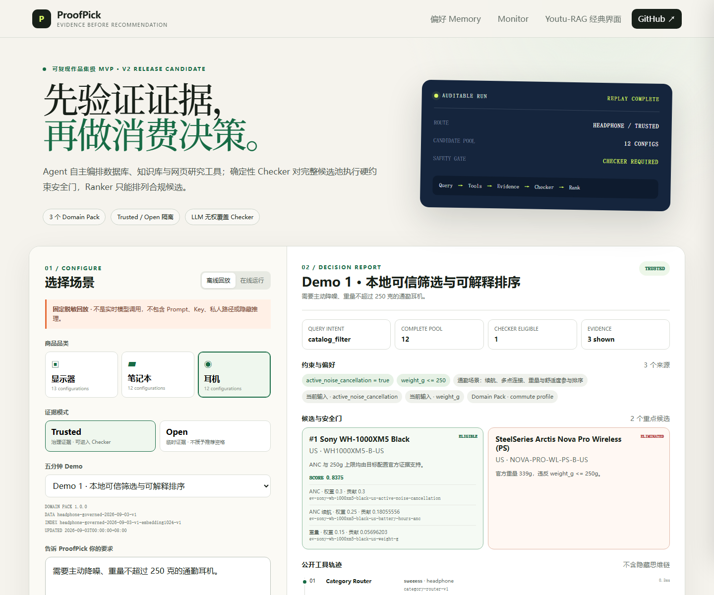
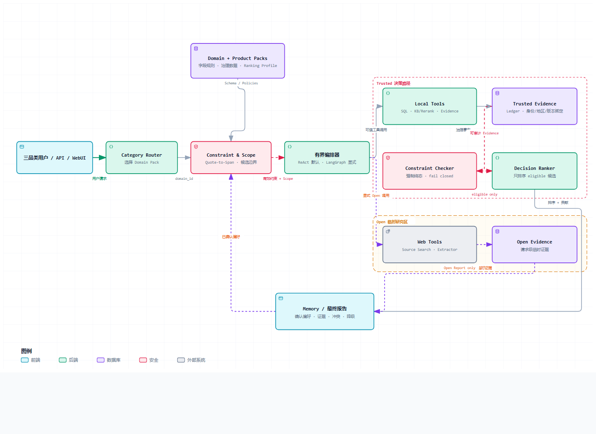

# ProofPick — 先验证证据，再做消费决策

一个基于 Agentic RAG 的多源消费决策 Agent：自主组合结构化查询、知识库、开放网页研究与证据核验，并用不可被 LLM 覆盖的确定性安全门阻止违反硬条件的推荐。

[](https://github.com/franklil0401/proofpick_agent/actions/workflows/ci.yml) [](https://www.python.org/) [](LICENSE) [](smartbuy/docs/v2/v2_9a_release_candidate_report.md)

[V2 五分钟 Demo](smartbuy/docs/v2/v2_demo_guide.md) · [Windows 启动](#windows-快速开始) · [核心代码](#核心代码入口) · [V1 在线脱敏回放](https://franklil0401.github.io/proofpick_agent/)

[](smartbuy/docs/v2/v2_demo_guide.md)

> 可复现的作品集级 Release Candidate；截图与离线 Demo 是固定脱敏结果回放，不是实时模型调用。V2 独立评测结论为 `Needs revision`，尚未发布。

| 可复核结果 | 当前证据 |
|---|---:|
| 三个 Domain Pack | Monitor / Laptop / Headphone，共 **36 个当前 UI 可查询配置**；交叉污染 **0** |
| Headphone 二阶段检索 | 30 条冻结检索任务 Recall@5：**86.39% → 97.78%** |
| 自然约束安全 | 新 20 条 Live Holdout 首测：清晰硬约束 F1 **96.97%**，任务 **16/20**，安全误激活 **0** |
| 确定性排序 | What-if **12/12** 保持 Checker 集合；计分事实 Evidence 追溯 **117/117** |
| V1 公平对照 | 40 条冻结任务 × 3：Fixed RAG **51/120** → Agentic RAG + Checker **92/120** |

每项结果的分母、首次失败与 exposed regression 均保留在[阶段报告](smartbuy/docs/v2/README.md)；这些数字不是生产准确率、生产零违规或 SLA。

## 为什么它是 Agent

- **自主选择并继续调用工具：** 有界 ReAct 根据任务选择 Product Query/Text2SQL、KB Search、Evidence Check；信息不足时补查、澄清或明确降级，而不是固定塞入 Top-K 文本。
- **状态会随对话变化：** 当前输入可新增、覆盖或取消约束；短期状态与用户确认的 Global/Category Memory 分层管理，未确认信息、价格和商品事实不会写入长期偏好。
- **生成模型没有最终裁决权：** LLM 负责理解、规划和解释；完整候选池必须经过确定性 Constraint Checker，Ranker 只能排序 eligible 候选，不能恢复淘汰项。

## 架构与证据模式

[](smartbuy/docs/assets/proofpick-v2-architecture.html)

| 层 | 职责 |
|---|---|
| Domain / Product Pack | 为品类声明字段、单位、别名、来源权限、Checker 与 Ranking Profile；数据和索引版本绑定 |
| Router + Constraint / Scope | 识别品类、服务端 Quote-to-Span、约束状态与不可扩大的商品/配置/地区范围 |
| 有界编排 | ReAct 为默认路径；LangGraph 可显式启用但仍是兼容外壳，两者共享工具和安全门 |
| Trusted 路径 | 只读商品查询、1024 维向量召回、qwen3-rerank、治理 Evidence、Checker、Ranker |
| Open 路径 | 智谱 Source Search 与静态 Extractor 形成请求级临时证据；不能进入治理 Ledger 或 Trusted Checker |
| Report / Memory | 输出候选、淘汰原因、Evidence、冲突、unknown、降级和公开工具轨迹；不展示隐藏思维链 |

当前产品首页可切换三个品类与 Trusted/Open 模式，展示完整候选池、Checker 资格、排序维度贡献、来源地区/配置/时间、Memory 管理和脱敏工具轨迹。原 Youtu-RAG 页面保留在 `/classic.html#/chat`。

## 核心代码入口

- [`smartbuy/agent/domain_agent.py`](smartbuy/agent/domain_agent.py)：三品类共享的需求、Scope、工具、Checker、Ranker 与报告链。
- [`smartbuy/domain_packs/`](smartbuy/domain_packs/) / [`smartbuy/product_packs/`](smartbuy/product_packs/)：版本化领域规则、治理商品数据和 Evidence Ledger。
- [`smartbuy/tools/`](smartbuy/tools/)：只读 Product Query/Text2SQL、KB Search、Evidence Check、Source Search 与 Web Extractor。
- [`smartbuy/constraints/verifier.py`](smartbuy/constraints/verifier.py) / [`smartbuy/ranking/`](smartbuy/ranking/)：强制硬约束门与 Evidence-bound 确定性排序。
- [`smartbuy/constraint_proposals/`](smartbuy/constraint_proposals/) / [`smartbuy/memory/`](smartbuy/memory/)：Quote-to-Span、主动澄清与分层偏好。
- [`smartbuy/orchestration/`](smartbuy/orchestration/)：ReAct/LangGraph 统一事件契约、Checkpoint、Interrupt 与显式特性开关。
- [`smartbuy/eval/`](smartbuy/eval/)：冻结任务、首次结果、回归、故障注入和评分器。

## Windows 快速开始

前置：Windows 11、Python 3.12、Git、`uv`、仓库外 MinIO，以及已配置的百炼环境变量；脚本只显示 `configured/missing`，不会打印值。

```powershell
git clone --branch feature/proofpick-v2 --single-branch https://github.com/franklil0401/proofpick_agent.git C:\ppv2rc
Set-Location C:\ppv2rc
.\smartbuy\scripts\preflight.ps1 -RuntimeRoot C:\ppv2run\v
.\smartbuy\scripts\bootstrap.ps1 -RuntimeRoot C:\ppv2run\m -V2RuntimeRoot C:\ppv2run\v
.\smartbuy\scripts\start.ps1 -SmartBuyRuntimeRoot C:\ppv2run\m -V2RuntimeRoot C:\ppv2run\v
```

访问 `http://127.0.0.1:8000/`。无 Key/MinIO 时可直接运行：

```powershell
.\smartbuy\scripts\replay.ps1 -Port 8088 -ServiceRuntimeRoot C:\ppv2run\replay
```

离线页面为 `http://127.0.0.1:8088/app.html`；停止方式、外部运行目录、索引费用与完整验证步骤见 [Windows 复现记录](smartbuy/docs/v2/v2_9a_windows_reproduction.md)。

## 上游边界、V1/V2 与限制

| Youtu-RAG 上游 | ProofPick 新增 |
|---|---|
| FastAPI、经典 WebUI、文件与知识库基础设施、基础 Agent/RAG 组件 | 百炼 Provider、Domain/Product Pack、治理数据、安全查询、Evidence 四态、约束/Scope、Open Research、Checker、Ranker、Memory、评测、统一产品 UI 与 Windows 脚本 |

固定版本和 MIT 归属见 [THIRD_PARTY_NOTICES](THIRD_PARTY_NOTICES.md)。`main` 与 `v1.0.0-portfolio` 继续保存 V1 稳定版；V2 仅在 `feature/proofpick-v2`，不会改写 V1 数据、索引或历史指标。

- 每个品类当前只有 12 个治理配置，不能外推到全市场或任意新品。
- Open Research 受搜索索引、地区和静态页面可见性限制；临时网页证据不授予 Trusted 推荐资格。
- 价格仅演示带 `observed_at`、TTL 和哈希的一次观察；过期或正文不可核验时返回 unknown，不保证实时价格/库存。
- 默认编排仍是 ReAct；LangGraph 尚未完成图原生生产迁移，本地 SQLite Checkpoint 也不是生产级多租户方案。
- V2-9B 独立首次 Trusted 为 64/90；通用修复后的同题 exposed regression 为 86/90。后者只能证明已知路径改善，不能冒充新的泛化或发布结果。

## 文档与 License

- [五个 Demo 与真实/回放步骤](smartbuy/docs/v2/v2_demo_guide.md)
- [V2-9A RC 报告](smartbuy/docs/v2/v2_9a_release_candidate_report.md) / [Windows 干净克隆](smartbuy/docs/v2/v2_9a_windows_reproduction.md)
- [V2-9C 独立评测修复报告](smartbuy/docs/v2/v2_9c_independent_evaluation_repair_report.md)
- [V2 文档索引](smartbuy/docs/v2/README.md) / [V2 开发流程](smartbuy/docs/v2/V2_DEVELOPMENT_PROCESS.md)
- [V1 作品集指标](smartbuy/docs/portfolio_metrics.md) / [数据卡](smartbuy/docs/data_card.md) / [项目结构](smartbuy/docs/development/PROJECT_STRUCTURE.md)

本项目自行开发代码采用 [MIT License](LICENSE)；数据许可单独记录。感谢 TencentCloudADP 的 [Youtu-RAG](https://github.com/TencentCloudADP/youtu-rag)。
