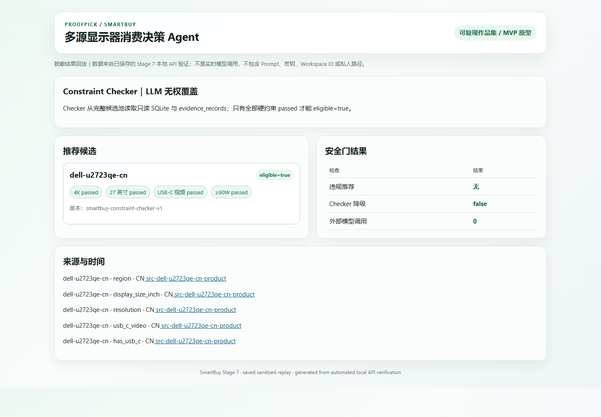
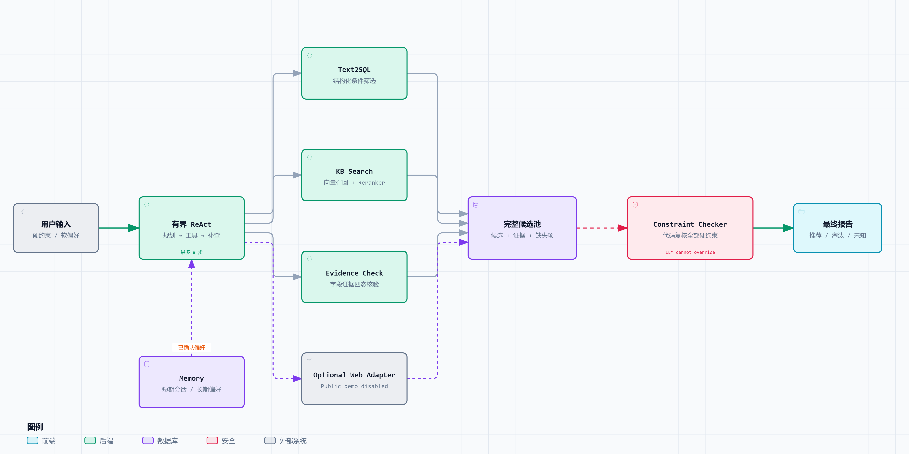

# ProofPick

基于 Agentic RAG 的消费决策 Agent：自主调用 Text2SQL、知识库检索和证据核验工具，并使用确定性安全门阻止违反硬条件的推荐。`SmartBuy` 是当前的显示器选购演示场景。

[](https://github.com/franklil0401/proofpick_agent/actions/workflows/ci.yml) [](https://www.python.org/) [](LICENSE) [](smartbuy/docs/release_report.md)

[在线脱敏演示](https://franklil0401.github.io/proofpick_agent/) · [五分钟 Demo](smartbuy/docs/demo_guide.md) · [核心代码](#核心代码入口)

| 核心指标 | 结果 |
|---|---:|
| Agent 对照 | Fixed RAG **51/120（42.50%）** → 增强组 **92/120（76.67%）** |
| 二阶段检索 | 36 条人工核验用例 Recall@5：**89.12% → 98.38%** |
| 约束安全 | 阶段 6 增强组违规候选推荐：**0/43** |
| 自动化质量门 | **95 tests passed** |

40 条冻结任务重复 3 次；完整四组消融、失败样本、成本和统计口径见[作品集指标](smartbuy/docs/portfolio_metrics.md)与[阶段 6 报告](smartbuy/docs/stage6_evaluation_and_resilience_report.md)。

[](https://franklil0401.github.io/proofpick_agent/)

> 可复现的作品集级 MVP；Demo 为脱敏结果回放，非实时模型调用。

## 为什么它是 Agent

- **自主选择工具：** 有界 ReAct 根据问题调用 Text2SQL、KB Search 或 Evidence Check，信息不足时继续补查。
- **支持连续追问：** 保存当前会话条件和用户确认的长期偏好，新要求可以覆盖旧条件。
- **推荐前强制复核：** LLM 负责规划和解释，SQL/代码负责检查预算、尺寸和接口等硬要求。

固定 RAG 的检索路径和上下文通常预先确定；ProofPick 会根据候选数量、字段缺失与证据冲突继续规划，并把最终推荐资格交给确定性代码，而不是交给生成模型自由判断。

## 系统架构



一次典型请求按以下顺序执行：

1. 有界 ReAct 合并本轮需求与用户确认的 Memory，根据问题和已有观察决定下一项工具。
2. Text2SQL 从只读商品库筛出候选，避免让 LLM 依靠常识猜测预算、尺寸或接口参数。
3. KB Search 使用向量召回和 Reranker 查找型号证据，Evidence Check 标记满足、不满足、未知或冲突。
4. 工具结果汇入完整候选池，缺少关键字段时由 ReAct 继续补查，而不是提前生成推荐。
5. Constraint Checker 用 SQL/代码独立复核全部硬约束；失败、未知或冲突候选不能进入推荐集合。
6. 最终报告只解释通过安全门的候选，并保留来源、淘汰原因和降级状态；LLM 不能覆盖 Checker 结果。

Optional Web Adapter 使用灰色虚线表示，公开 Demo 默认关闭，不位于 KB + SQL 的核心链路中。

## 核心代码入口

- [`smartbuy/agent/react.py`](smartbuy/agent/react.py)：ReAct 规划、工具编排和停止条件。
- [`smartbuy/tools/`](smartbuy/tools/)：Text2SQL、KB Search 和 Evidence Check。
- [`smartbuy/constraints/verifier.py`](smartbuy/constraints/verifier.py)：确定性硬约束复核。
- [`smartbuy/memory/store.py`](smartbuy/memory/store.py)：短期会话和长期偏好记忆。
- [`smartbuy/eval/`](smartbuy/eval/)：冻结任务、消融实验和故障评测。

这五个入口覆盖从需求规划、工具执行、会话状态到最终安全门和可复现实验的主链；FastAPI、WebUI 与知识库基础设施继续复用固定版本的 Youtu-RAG，不将上游实现包装为个人从零开发。

## Windows 快速启动

```powershell
git clone https://github.com/franklil0401/proofpick_agent.git C:\ai\proofpick
Set-Location C:\ai\proofpick
.\smartbuy\scripts\preflight.ps1
.\smartbuy\scripts\bootstrap.ps1
.\smartbuy\scripts\start.ps1
```

前置条件：Python 3.12、Git、`uv`、仓库外 MinIO，以及已配置的百炼环境变量。完整配置、运行目录、费用边界和停止方式见 [Runtime Manifest](smartbuy/docs/runtime_manifest.md)。

启动后访问 `http://127.0.0.1:8000/`，在 WebUI 中启用 **SmartBuy**。

## Youtu-RAG 上游边界与主要限制

| Youtu-RAG 上游 | ProofPick 新增 |
|---|---|
| FastAPI、WebUI、文件与知识库基础设施 | 百炼模型适配、治理数据、安全 Text2SQL、有界 ReAct、Evidence Check、Memory、Constraint Checker、评测与 Windows 脚本 |

上游以固定 Commit 的 Git subtree 保留在 `vendor/youtu-rag/`；归属、许可证和接线差异见 [THIRD_PARTY_NOTICES](THIRD_PARTY_NOTICES.md)。

- 当前仅覆盖 12 个显示器型号。
- 未接入真实 Web Search，价格不是实时数据。
- 冻结评测结果不代表生产准确率、生产零违规或 SLA。

## 详细文档与 License

- [五分钟 Demo](smartbuy/docs/demo_guide.md)：固定输入、工具轨迹、截图和备用步骤。
- [Runtime Manifest](smartbuy/docs/runtime_manifest.md) / [Data Card](smartbuy/docs/data_card.md)：环境、运行方式、数据构建和许可边界。
- [作品集指标](smartbuy/docs/portfolio_metrics.md) / [发布报告](smartbuy/docs/release_report.md)：实验分母、历史失败和发布复现。
- [开发指南](smartbuy/docs/development/DEVELOPMENT_GUIDE.md) / [项目结构](smartbuy/docs/development/PROJECT_STRUCTURE.md)：工程规范与代码地图。

本项目自行开发代码采用 [MIT License](LICENSE)，适用于公开作品集审阅与本地复现。数据许可独立记录；感谢 TencentCloudADP 的 [Youtu-RAG](https://github.com/TencentCloudADP/youtu-rag)。
