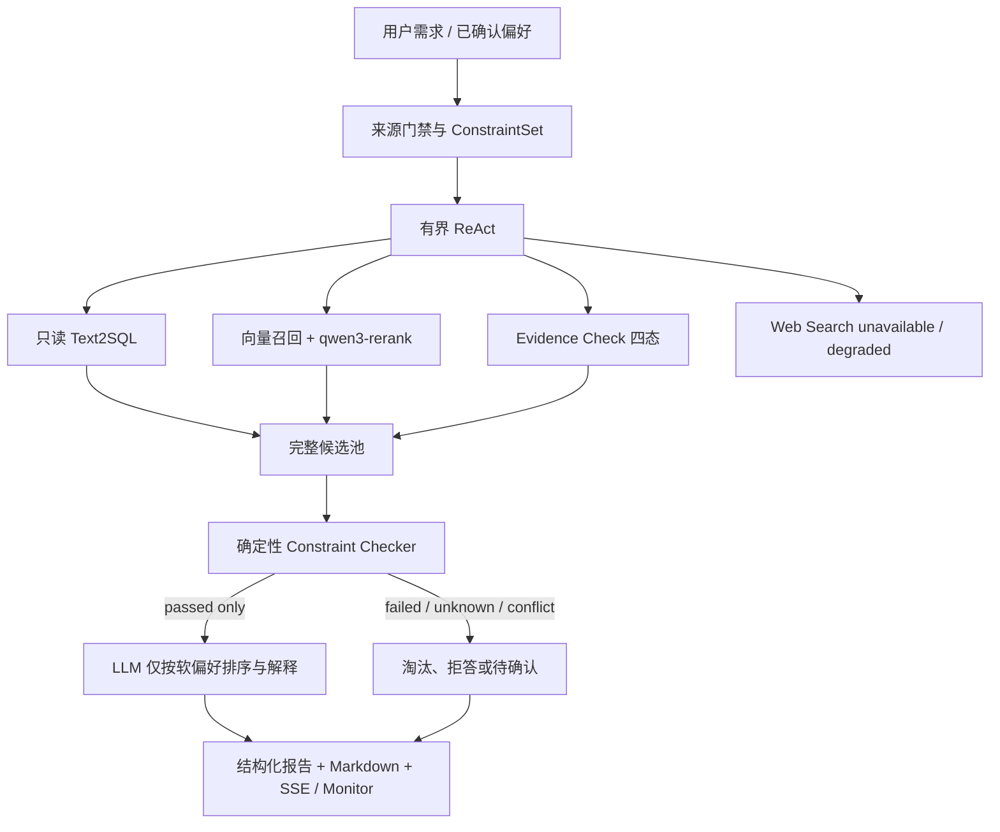
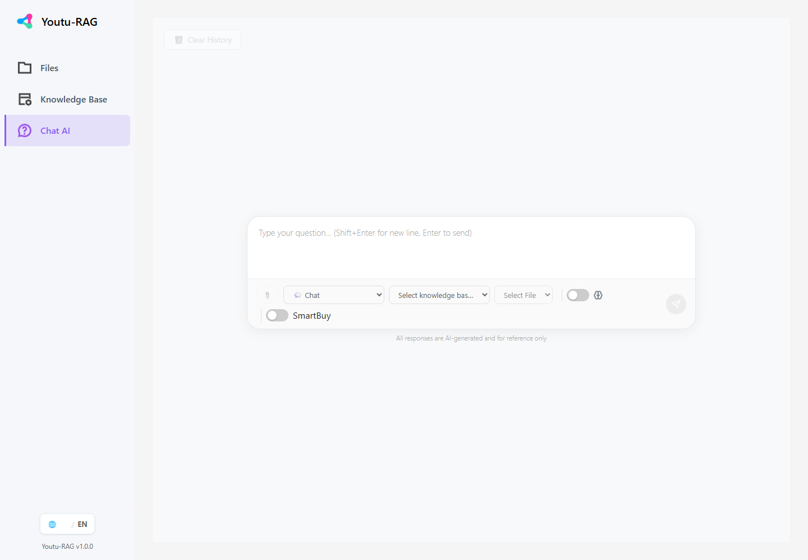
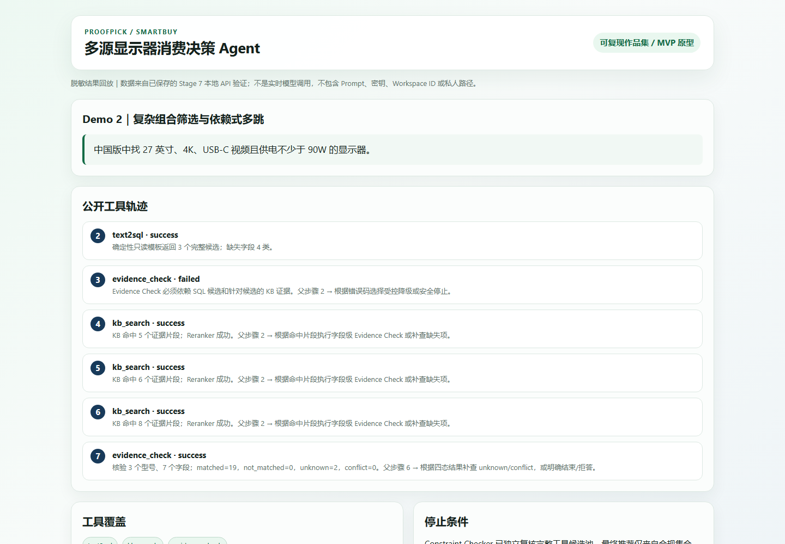

# ProofPick Agent

## SmartBuy：基于 Agentic RAG 的多源显示器消费决策场景

ProofPick 把自然语言需求转为可追溯约束，由有界 ReAct 自主编排只读 SQL、知识库与证据检查，再用不可被 LLM 覆盖的确定性安全门阻止违规推荐。

[](https://github.com/franklil0401/proofpick_agent/actions/workflows/ci.yml?query=branch%3Achore%2Fportfolio-polish)
[](https://www.python.org/)
[](https://www.microsoft.com/windows/)
[](LICENSE)
[](smartbuy/docs/release_report.md)

> **当前状态：可复现的作品集 / MVP 原型。** SmartBuy 是首个中国大陆显示器消费决策场景和 Python 业务模块：12 个治理型号、40 条冻结自然任务。项目不是生产级系统、实时电商搜索平台或全品类购物助手。


主图是已保存本地 API 验证结果的脱敏回放，不是实时模型调用；不含 Prompt、密钥、Workspace ID 或私人路径。

| 发布候选 | 三次公平对照 | 约束安全 | Checker 确定性 |
|---:|---:|---:|---:|
| **34/40** | Fixed RAG **51/120** → 增强组 **92/120**（+34.17 个百分点） | 增强组首次违规候选推荐 **0/43** | 同输入三次字节一致 **40/40**；额外模型调用 **0** |

这些数字只适用于当前显示器数据版本、冻结任务和已支持约束字段，不代表系统准确率 100% 或生产 SLA。完整分母、历史失败与允许表述见[作品集指标口径](smartbuy/docs/portfolio_metrics.md)。

## 为什么它是真实 Agent，而不是普通 RAG

- 有界 ReAct 会根据任务和工具观察动态选择 Text2SQL、KB Search、Evidence Check，并按缺失字段执行依赖式多跳；不是固定检索后拼接 Prompt。
- `matched/not_matched/unknown/conflict` 四态证据与工具失败状态进入公开轨迹；不展示隐藏思维链。
- Constraint Checker 从完整工具候选池独立读取只读 SQLite 和证据记录；LLM 只能解释、不能改写资格集合，异常时 fail closed。

## 上游与本项目贡献边界

| Youtu-RAG 上游能力 | 本项目新增能力 |
|---|---|
| FastAPI/WebUI；文件与知识库基础设施；基础 Agent/RAG 组件 | 百炼 LLM/Embedding/Reranker Provider；治理后的显示器数据与证据模型；有界 ReAct；安全 Text2SQL；四态 Evidence Check；分层 Memory；确定性 Constraint Checker；四组评测、缓存、故障注入、统一账本；Windows 复现脚本与消费决策展示 |

上游固定 Commit、供应商目录改动和 MIT 归属见 [THIRD_PARTY_NOTICES](THIRD_PARTY_NOTICES.md)。本项目没有把 Youtu-RAG 原生能力描述为个人从零实现。

## 立即看 Demo

- [五分钟 Demo 指南](smartbuy/docs/demo_guide.md)：4 个固定输入、预期工具轨迹、实测耗时和失败备用步骤。
- [脱敏结果回放](smartbuy/docs/assets/demo_replay.html)：下载后本地打开；醒目标注“不是实时模型调用”。
- [发布报告](smartbuy/docs/release_report.md)：发布候选 `34/40`、Windows 干净复现、成本与已知边界。

## 项目解决的问题

显示器选购的稳定规格分散在官方说明书、支持页面与产品页，价格又有地区和时间边界。普通搜索难以同时核验型号版本与多项硬条件；普通聊天模型可能依赖过时知识或遗漏约束；固定 RAG 能找证据，却不擅长先筛候选、再按缺失字段多跳补查，也不能阻止模型推荐已违反预算或接口要求的商品。

SmartBuy 面向希望减少手工查证的普通消费者和数码爱好者。用户可以提出“27 英寸、4K、非 OLED、USB-C 视频且至少 90W 供电”等组合需求，系统区分硬约束、软偏好、未知和冲突，并保留可追溯来源。

## 核心能力

- 最多 8 步、12 次工具调用的有界 qwen-plus ReAct 循环，不记录隐藏思维链。
- 只读安全 Text2SQL、KB Search、qwen3-rerank 二阶段重排与 Evidence Check 协同。
- SQL 候选 → 分型号 KB 核验 → 缺失/冲突补查的依赖式多跳。
- 短期会话条件继承/覆盖；长期偏好须明确确认，支持查看、关闭和删除。
- `matched/not_matched/unknown/conflict` 四态证据模型。
- 从完整工具候选池独立复核的 Constraint Checker；LLM 不能修改资格集合。
- Web Search 标准接口在无凭据时显式 `unavailable/degraded`，KB + SQL 主链路仍可工作。
- 脱敏 SSE/Monitor、统一评测账本、安全缓存和受控故障注入。

## 系统架构



LLM 负责理解、规划、工具调用与解释；SQLite/证据记录提供事实；Checker 负责硬约束资格。Checker 不在 LLM 工具白名单中，异常时 fail closed。

## Agent 执行流程

1. 从当前输入、会话确认、启用的长期偏好和系统默认中构建带 provenance 的约束，优先级依次降低。
2. Agent 按任务选择 KB、SQL、Evidence 或不可用 Web 工具；依赖门禁阻止越序和越权。
3. 根据候选数量、缺失字段、来源冲突与工具状态继续多跳，达到步骤/预算上限时安全停止。
4. Checker 读取完整稳定 `model_id` 候选池、只读 SQLite 与同地区证据，逐字段生成 passed/failed/unknown/conflict。
5. 只有全部受支持硬约束 passed 的候选可进入软偏好排序；报告展示证据、时间、地区、降级和停止原因。

## 四个稳定 Demo

| Demo | 固定场景 | 实测结果 | 主要展示 |
|---|---|---:|---|
| 1 单文档事实 | U2723QE 尺寸与分辨率 | 通过，13.741s | KB 与官方证据；不调用 SQL/Web |
| 2 组合多跳 | 27 英寸、4K、USB-C 视频、≥90W | 通过，41.668s | SQL → KB → Evidence → Checker |
| 3 分层 Memory | 3500 元改为 2500 元并排除 OLED | 5/5，三轮 83.903s | 会话覆盖、跨会话召回、删除 |
| 4 冲突拒答 | PD2705U 官方 60W/65W 冲突 | 4/4，19.947s | 双方来源、conflict、无推荐 |

首次本地 API 演示验证为 **4/4**，6 次 Agent 调用估算 ¥0.2202436。完整输入、预期轨迹、备用步骤和截图见 [Demo 指南](smartbuy/docs/demo_guide.md)。

### 运行界面（基于 Youtu-RAG）



上图是本地实际 WebUI 入口；打开 SmartBuy 模式后，请求进入独立消费决策 API。下图是已保存验证结果的脱敏工具轨迹回放。



## Windows 快速开始

### 前置条件

- Windows 11、Python 3.12、Git、[uv](https://docs.astral.sh/uv/)。
- 从 MinIO 官方渠道取得 Windows Server 二进制，默认放在仓库外 `C:/ai/minio/minio.exe`；二进制不进入 Git。
- 在 Windows 系统环境变量配置 `Qianwen_api_key` 与 `Qianwen_workspace_id`，然后重启终端/IDE，使新进程继承。不要创建真实 `.env`。
- 为本地 MinIO 在当前 PowerShell 进程输入凭据，不写入脚本或系统环境：

```powershell
$env:MINIO_ROOT_USER = Read-Host "MinIO local user"
$securePassword = Read-Host "MinIO local password" -AsSecureString
$passwordPointer = [Runtime.InteropServices.Marshal]::SecureStringToBSTR($securePassword)
try {
    $env:MINIO_ROOT_PASSWORD = [Runtime.InteropServices.Marshal]::PtrToStringBSTR($passwordPointer)
} finally {
    [Runtime.InteropServices.Marshal]::ZeroFreeBSTR($passwordPointer)
}
```

### 克隆、构建与启动

```powershell
git clone https://github.com/franklil0401/proofpick_agent.git C:\ai\proofpick
Set-Location C:\ai\proofpick

./smartbuy/scripts/preflight.ps1
./smartbuy/scripts/bootstrap.ps1
./smartbuy/scripts/start.ps1
```

`bootstrap.ps1` 会执行冻结依赖同步、治理数据校验、仓库外 SQLite 幂等重建和 Chroma 校验；新环境首次构建 1024 维知识库会产生少量 Embedding 费用。脚本不会自动创建收费资源或修改系统环境变量。

发布复现使用 Commit `79e5575198919d323d22b6cb23719540610ea966` 从第三个全新短 ASCII clone 验证：11/11 preflight、294 包、SQLite 12/4/16/180、Chroma 60 chunks，且构建后工作区无变化。前两次失败及修复过程没有被删除，见 [发布报告](smartbuy/docs/release_report.md)。

访问入口：

- WebUI：`http://127.0.0.1:8000/`，在聊天页启用 **SmartBuy**。
- 健康检查：`http://127.0.0.1:8000/health`。
- Monitor：`http://127.0.0.1:8000/monitor`。
- MinIO Console：`http://127.0.0.1:9001/`。

完成后停止：

```powershell
./smartbuy/scripts/stop.ps1
```

`stop.ps1` 只停止 `start.ps1` 记录的进程树。自定义 MinIO 路径或运行目录可通过脚本参数覆盖；运行数据库、索引、对象存储、Memory 和日志始终位于 Git 仓库外。

## 环境变量

| 名称 | 用途 | 安全规则 |
|---|---|---|
| `Qianwen_api_key` | qwen-plus、Embedding、Reranker 共用 Key | 敏感；只从当前进程读取，禁止输出或持久化 |
| `Qianwen_workspace_id` | 百炼业务空间 | 统一配置层读取，不散落硬编码 |
| `MINIO_ROOT_USER` / `MINIO_ROOT_PASSWORD` | 本地 MinIO Server | 仅当前进程；不得提交 |
| `MINIO_ACCESS_KEY` / `MINIO_SECRET_KEY` | Youtu-RAG 访问 MinIO | 启动脚本只在子进程映射 |
| `SMARTBUY_DB_PATH` / `SMARTBUY_INDEX_PATH` / `SMARTBUY_MEMORY_PATH` | 仓库外运行资产 | `start.ps1` 自动设置，不需写 `.env` |

轮换 Key 后必须重启长期运行进程。Embedding 模型、维度或预处理变化后必须使用新索引并全量重建。

## 数据与知识库

当前公开 Demo 数据为 12 型号、4 品牌、16 来源、4 条离线价格观察、180 条字段证据和 12 份自制事实卡。SQLite 由 JSON/JSONL 和脚本生成，不手工维护；Chroma 索引含 60 chunks，每块记录型号、地区、来源、访问时间、切分版本、Embedding 模型和 1024 维契约。

离线重建与校验：

```powershell
$env:PYTHONPATH = (Get-Location).Path
uv run --project vendor/youtu-rag python -m smartbuy.scripts.build_stage3_data
uv run --project vendor/youtu-rag python -m smartbuy.scripts.validate_stage3_data
uv run --project vendor/youtu-rag python -m smartbuy.db.build_database `
  --output C:\ai\smartbuy-stage3\smartbuy_monitors_v1.sqlite
```

数据许可、缺失和冲突见 [数据卡](smartbuy/docs/data_card.md)。价格只能解释为带 `observed_at` 的历史观察，不保证实时价格或库存。

## 测试与评测

本地自动化：

```powershell
$env:PYTHONPATH = (Get-Location).Path
uv run --project vendor/youtu-rag --group dev python -m pytest smartbuy/tests -q
uv run --project vendor/youtu-rag ruff check smartbuy
```

GitHub Actions 在 `windows-latest` / Python 3.12 上执行同一套离线测试、Ruff、`compileall`、PowerShell AST 与 Markdown 链接检查。工作流显式清空模型变量，不配置 Secret，不启动 MinIO/Chroma，也不调用百炼 API；定义见 [`.github/workflows/ci.yml`](.github/workflows/ci.yml)。

冻结和韧性检查：

```powershell
uv run --project vendor/youtu-rag python -m smartbuy.eval.run_stage6_eval --validate-freeze
uv run --project vendor/youtu-rag python -m smartbuy.eval.run_stage6_resilience --all-local
uv run --project vendor/youtu-rag python -m smartbuy.eval.run_stage6_checker_determinism
```

在线四组完整三次评测成本较高，默认不运行。可复现命令、配置哈希、首次失败和 checkpoint 规则见 [阶段 6 报告](smartbuy/docs/stage6_evaluation_and_resilience_report.md)。

## 四组实验结果

40 条冻结自然任务中包含 16 条 regression 与 24 条首次完整运行前冻结的 holdout；每组重复 3 次。主实验 cold/no-cache，不能与热缓存混比。

| 组 | 三次聚合 E2E | 当前能力边界 |
|---|---:|---|
| Direct LLM | 46/120 | 仅 qwen-plus；无数据与工具 |
| Fixed RAG | 51/120 | 固定向量 + Reranker + LLM |
| Agentic RAG | 81/120 | ReAct、SQL、KB、Evidence；无最终 Checker |
| Agentic RAG + Checker | **92/120** | 完整增强链路 |

增强组相对 Fixed RAG 高 **34.17 个百分点**，相对 Agentic RAG 高 **9.17 个百分点**。但增强组聚合仍只有 **92/120（76.67%）**，阶段 6 首次 holdout 为 **15/24（62.5%）**，不能解释为生产准确率或 SLA。

阶段 7 当前代码的独立单次发布候选为 **34/40**（regression 16/16、holdout 18/24）；它不替换或合并阶段 6 历史结果。详见 [发布报告](smartbuy/docs/release_report.md)。

## Constraint Checker 消融

- 阶段 6 首次自然任务中，违规候选推荐由 Agentic RAG 的 **10/38** 降为增强组 **0/43**；两组分母不同。
- 增强组最终候选集合三次一致 **40/40**。
- 固定同一输入、候选池、SQLite、证据和 as_of 时，Checker 三次字节一致 **40/40**，额外模型调用和成本为 0。
- 该结论只适用于当前数据版本和首批受支持约束字段，不表示生产环境零违规。

## 缓存与错误恢复

- 13 类受控故障注入 **13/13** 进入预期重试、降级或 fail-closed 路径；401/403 不重试，429/5xx/超时有界退避。
- Checker 异常时不输出购买推荐；SQLite/Chroma 不可用时不让 LLM 心算硬约束或伪装证据核验。
- 5 条公共 KB 查询热缓存输出一致 **5/5**，平均延迟从 1441.682ms 降至 10.436ms；仅是小样本稳定查询，不代表系统整体或生产性能。
- 动态价格、库存、Memory 写入、最终自由文本、敏感请求和失败结果默认不缓存。

## 安全、数据许可与隐私

- 禁止提交或展示 API Key、Workspace ID 值、Authorization、私钥、真实 `.env`、完整 Prompt 或隐藏思维链。
- 长期 Memory 只保存用户明确确认的稳定偏好；不保存价格、库存、商品事实或模型推测。
- 事实卡是基于公开来源自行表述的短摘要；受限 PDF、网页全文、大量评论、Cookie 与个人信息不进入仓库。
- SQL 只读、单 SELECT、表列白名单、authorizer、行数和超时受限；不执行模型生成代码。
- 服务默认只绑定 `127.0.0.1`；本项目未实现公网多租户安全边界。

## 已知限制

- 只有显示器一个品类、12 个治理型号；不支持全品类。
- Web Search 只有 unavailable/degraded 接口；没有实时网页搜索。
- 只有 4 条离线价格观察；不保证实时价格或库存。
- 阶段 7 发布候选仍有 6/40 E2E 未完成，unknown/conflict 的首次完整结果为 2/5。
- 上游 LLM 路由和结构化输出并非完全确定，延迟也不是生产 SLA。
- GraphRAG、Neo4j、第二品类、自动下单、生产级高并发与公网部署未实现。

## 项目结构与文档导航

- [PROJECT_STRUCTURE.md](PROJECT_STRUCTURE.md)：当前真实文件结构事实来源。
- [DEVELOPMENT_GUIDE.md](DEVELOPMENT_GUIDE.md)：开发路线、验收指标、DoD 与风险。
- [Runtime Manifest](smartbuy/docs/runtime_manifest.md)：环境、版本、运行路径与实测状态。
- [Demo 指南](smartbuy/docs/demo_guide.md)：四个五分钟案例、备用步骤和截图。
- [发布报告](smartbuy/docs/release_report.md)：发布候选、修复、复现、成本和边界。
- [作品集指标](smartbuy/docs/portfolio_metrics.md)：每个数字的分母、Commit 与允许/禁止表述。
- [发布检查清单](smartbuy/docs/release_checklist.md)：质量、安全、许可与远端状态。
- [阶段 6 报告](smartbuy/docs/stage6_evaluation_and_resilience_report.md)：四组实验、缓存、故障与历史失败。
- [FINAL 开发交接文档](FINAL_多源消费决策研究Agent开发交接总文档.md) 与 [百炼 API 说明](阿里云百炼API-Key调用与Youtu-RAG接入说明.md)。

更多阶段报告与 ADR 见 [`smartbuy/docs/`](smartbuy/docs/)。

## License 与致谢

本项目自行开发代码采用 [MIT License](LICENSE)。数据许可独立记录，不自动沿用代码许可。感谢 TencentCloudADP 的 [Youtu-RAG](https://github.com/TencentCloudADP/youtu-rag)；供应商目录保留上游 MIT License 和归属说明。
